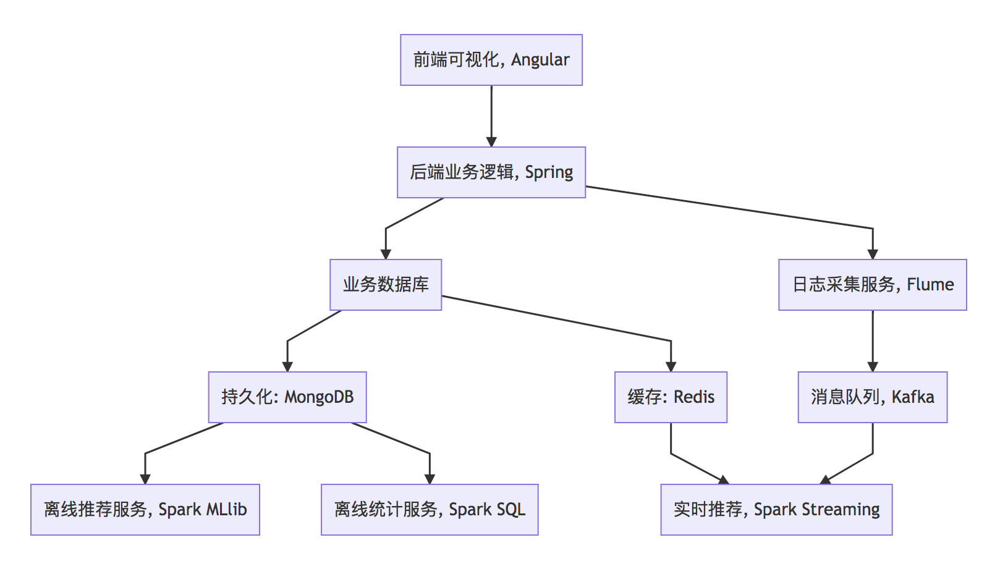

# 第1章 项目体系架构设计

## 1.1 项目系统架构

项目以推荐系统建设领域知名的经过修改过的中文亚马逊电商数据集作为依托，以某电商网站真实业务数据架构为基础，构建了符合教学体系的一体化的电商推荐系统，包含了离线推荐与实时推荐体系，综合利用了协同过滤算法以及基于内容的推荐方法来提供混合推荐。提供了从前端应用、后台服务、算法设计实现、平台部署等多方位的闭环的业务实现。

电商推荐系统架构图



架构图代码，使用mermaid渲染出架构图

```
graph TD
A[前端可视化, Angular] --> B[后端业务逻辑, Spring]
B --> C[业务数据库]
C --> D[持久化: MongoDB]
C --> E[缓存: Redis]
D --> F[离线推荐服务, Spark MLlib]
D --> G[离线统计服务, Spark SQL]
B --> H[日志采集服务, Flume]
H --> I[消息队列, Kafka]
I --> J[实时推荐, Spark Streaming]
E --> J
```

- 用户可视化：主要负责实现和用户的交互以及业务数据的展示，主体采用AngularJS2进行实现，部署在Apache服务上。
- 综合业务服务：主要实现JavaEE层面整体的业务逻辑，通过Spring进行构建，对接业务需求。部署在Tomcat上。

### 【数据存储部分】

- 业务数据库：项目采用广泛应用的文档数据库MongoDB作为主数据库，主要负责平台业务逻辑数据的存储。
- 缓存数据库：项目采用Redis作为缓存数据库，主要用来支撑实时推荐系统部分对于数据的高速获取需求。

#### 【离线推荐部分】

- 离线统计服务：批处理统计性业务采用Spark Core + Spark SQL进行实现，实现对指标类数据的统计任务。
- 离线推荐服务：离线推荐业务采用Spark Core + Spark MLlib进行实现，采用ALS算法进行实现。
- 基于内容的推荐：采用TF-IDF算法提取UGC标签的关键词，计算商品之间的余弦相似度。
- 基于物品的协同过滤推荐：实现传统的Item-CF算法。

#### 【实时推荐部分】

- 日志采集服务：通过利用Flume-ng对业务平台中用户对于电影的一次评分行为进行采集，实时发送到Kafka集群。
- 消息缓冲服务：项目采用Kafka作为流式数据的缓存组件，接受来自Flume的数据采集请求。并将数据推送到项目的实时推荐系统部分。
- 实时推荐服务：项目采用Spark Streaming作为实时推荐系统，通过接收Kafka中缓存的数据，通过设计的推荐算法实现对实时推荐的数据处理，并将结构合并更新到MongoDB数据库。

## 1.2 项目数据流程

电商推荐系统数据流图

**略**

### 【系统初始化部分】
0.	通过Spark SQL将系统初始化数据加载到MongoDB中。
【离线推荐部分】
1.	离线统计服务从MongoDB中加载数据，将【商品平均评分统计】、【商品评分个数统计】、【最近商品评分个数统计】三个统计算法进行运行实现，并将计算结果回写到MongoDB中；离线推荐服务从MongoDB中加载数据，通过ALS算法分别将【用户推荐结果矩阵】、【商品相似度矩阵】回写到MongoDB中。
### 【实时推荐部分】
2.	Flume从综合业务服务的运行日志中读取日志更新，并将更新的日志实时推送到Kafka中；Kafka在收到这些日志之后，通过kafkaStream程序对获取的日志信息进行过滤处理，获取用户评分数据流【userId|productId|score|timestamp】，并发送到另外一个Kafka队列；Spark Streaming监听Kafka队列，实时获取Kafka过滤出来的用户评分数据流，融合存储在Redis中的用户最近评分队列数据，提交给实时推荐算法，完成对用户新的推荐结果计算；计算完成之后，将新的推荐结构和MongDB数据库中的推荐结果进行合并。
### 【业务系统部分】
3.	推荐结果展示部分，从MongoDB中将离线推荐结果、实时推荐结果、内容推荐结果进行混合，综合给出相对应的数据。
4.	商品信息查询服务通过对接MongoDB实现对商品信息的查询操作。
5.	商品评分部分，获取用户通过UI给出的评分动作，后台服务进行数据库记录后，一方面将数据推动到Redis群中，另一方面，通过预设的日志框架输出到Tomcat中的日志中。
6.	商品标签部分，项目提供用户对电影打标签服务。

## 1.3 数据模型

1. 商品数据表

| 字段名 | 字段类型 | 字段描述 | 字段备注 |
|-------|---------|---------|--------|
|productId|Int|商品ID|
|name|String|商品名字|
|categories|String|商品分类|
|imageUrl|String|图片url|
|tags|String|UGC标签|

2. 评分数据表

字段名|字段类型|字段描述|字段备注
-----|------|-------|------
userid|Int|用户ID|	
productId|Int|商品ID|	
score|Double|商品分值|
timestamp|Long|评分时间|	

3. 用户表

字段名|字段类型|字段描述|字段备注
-----|-------|-------|-----
productId|Int|用户的ID
username|String|用户名
password|String|用户密码
first|boolean|用于是否第一次登录
timestamp|Long|用户创建的时间

# 第2章 工具环境搭建

我们的项目中用到了多种工具进行数据的存储、计算、采集和传输，本章主要简单介绍设计的工具环境搭建。

如果机器的配置不足，推荐只采用一台虚拟机进行配置，而非完全分布式，将该虚拟机CPU的内存设置的尽可能大，推荐为CPU > 4、MEM > 4GB。

## 2.1 MongoDB（单节点）环境配置

```sh
// 通过WGET下载Linux版本的MongoDB
[bigdata@linux ~]$ wget https://fastdl.mongodb.org/linux/mongodb-linux-x86_64-rhel62-3.4.3.tgz
// 将压缩包解压到指定目录
[bigdata@linux backup]$ tar -xf mongodb-linux-x86_64-rhel62-3.4.3.tgz -C ~/
// 将解压后的文件移动到最终的安装目录
[bigdata@linux ~]$ mv mongodb-linux-x86_64-rhel62-3.4.3/ /usr/local/mongodb
// 在安装目录下创建data文件夹用于存放数据和日志
[bigdata@linux mongodb]$ mkdir /usr/local/mongodb/data/
// 在data文件夹下创建db文件夹，用于存放数据
[bigdata@linux mongodb]$ mkdir /usr/local/mongodb/data/db/
// 在data文件夹下创建logs文件夹，用于存放日志
[bigdata@linux mongodb]$ mkdir /usr/local/mongodb/data/logs/
// 在logs文件夹下创建log文件
[bigdata@linux mongodb]$ touch /usr/local/mongodb/data/logs/ mongodb.log

// 在data文件夹下创建mongodb.conf配置文件
[bigdata@linux mongodb]$ touch /usr/local/mongodb/data/mongodb.conf
// 在mongodb.conf文件中输入如下内容
[bigdata@linux mongodb]$ vim ./data/mongodb.conf
```

配置文件内容：

```
#端口号port = 27017
#数据目录
dbpath = /usr/local/mongodb/data/db
#日志目录
logpath = /usr/local/mongodb/data/logs/mongodb.log
#设置后台运行
fork = true
#日志输出方式
logappend = true
```

完成MongoDB的安装后，启动MongoDB服务器：

```sh
// 启动MongoDB服务器
[bigdata@linux mongodb]$ sudo /usr/local/mongodb/bin/mongod -config /usr/local/mongodb/data/mongodb.conf
// 访问MongoDB服务器
[bigdata@linux mongodb]$ /usr/local/mongodb/bin/mongo
// 停止MongoDB服务器
[bigdata@linux mongodb]$ sudo /usr/local/mongodb/bin/mongod -shutdown -config /usr/local/mongodb/data/mongodb.conf
```

## 2.2 Redis（单节点）环境配置

```sh
// 通过WGET下载REDIS的源码
[bigdata@linux ~]$wget http://download.redis.io/releases/redis-4.0.2.tar.gz 
// 将源代码解压到安装目录
[bigdata@linux ~]$ tar -xf redis-4.0.2.tar.gz -C ~/
// 进入Redis源代码目录，编译安装
[bigdata@linux ~]$ cd redis-4.0.2/
// 安装GCC
[bigdata@linux ~]$ sudo yum install gcc
// 编译源代码
[bigdata@linux redis-4.0.2]$ make MALLOC=libc
// 编译安装
[bigdata@linux redis-4.0.2]$ sudo make install
// 创建配置文件
[bigdata@linux redis-4.0.2]$ sudo cp ~/redis-4.0.2/redis.conf /etc/ 
// 修改配置文件中以下内容
[bigdata@linux redis-4.0.2]$ sudo vim /etc/redis.conf
daemonize yes   #37行  #是否以后台daemon方式运行，默认不是后台运行
pidfile /var/run/redis/redis.pid   #41行  #redis的PID文件路径（可选）
bind 0.0.0.0    #64行  #绑定主机IP，默认值为127.0.0.1，我们是跨机器运行，所以需要更改
logfile /var/log/redis/redis.log   #104行  #定义log文件位置，模式log信息定向到stdout，输出到/dev/null（可选）
dir “/usr/local/rdbfile”  #188行  #本地数据库存放路径，默认为./，编译安装默认存在在/usr/local/bin下（可选）
在安装完Redis之后，启动Redis
// 启动Redis服务器
[bigdata@linux redis-4.0.2]$ redis-server /etc/redis.conf
// 连接Redis服务器
[bigdata@linux redis-4.0.2]$ redis-cli
// 停止Redis服务器
[bigdata@linux redis-4.0.2]$ redis-cli shutdown
```

在安装完Redis之后，启动Redis

```sh
// 启动Redis服务器
[bigdata@linux redis-4.0.2]$ redis-server /etc/redis.conf
// 连接Redis服务器
[bigdata@linux redis-4.0.2]$ redis-cli
// 停止Redis服务器
[bigdata@linux redis-4.0.2]$ redis-cli shutdown
```

## 2.3 Spark（单节点）环境配置

```sh
// 通过wget下载zookeeper安装包
[bigdata@linux ~]$ wget https://d3kbcqa49mib13.cloudfront.net/spark-2.1.1-bin-hadoop2.7.tgz 
// 将spark解压到安装目录
[bigdata@linux ~]$ tar –xf spark-2.1.1-bin-hadoop2.7.tgz –C ./cluster
// 进入spark安装目录
[bigdata@linux cluster]$ cd spark-2.1.1-bin-hadoop2.7/
// 复制slave配置文件
[bigdata@linux spark-2.1.1-bin-hadoop2.7]$ cp ./conf/slaves.template ./conf/slaves    
// 修改slave配置文件
[bigdata@linux spark-2.1.1-bin-hadoop2.7]$ vim ./conf/slaves
linux  #在文件最后将本机主机名进行添加
// 复制Spark-Env配置文件
[bigdata@linux spark-2.1.1-bin-hadoop2.7]$ cp ./conf/spark-env.sh.template ./conf/spark-env.sh 
SPARK_MASTER_HOST=linux       #添加spark master的主机名
SPARK_MASTER_PORT=7077        #添加spark master的端口号
```

安装完成之后，启动Spark

```sh
// 启动Spark集群
[bigdata@linux spark-2.1.1-bin-hadoop2.7]$ sbin/start-all.sh
// 访问Spark集群，浏览器访问http://linux:8080
 
// 关闭Spark集群
[bigdata@linux spark-2.1.1-bin-hadoop2.7]$ sbin/stop-all.sh
```

## 2.4 Zookeeper（单节点）环境配置

```sh
// 通过wget下载zookeeper安装包
[bigdata@linux ~]$ wget http://mirror.bit.edu.cn/apache/zookeeper/zookeeper-3.4.10/zookeeper-3.4.10.tar.gz 
// 将zookeeper解压到安装目录
[bigdata@linux ~]$ tar –xf zookeeper-3.4.10.tar.gz –C ./cluster
// 进入zookeeper安装目录
[bigdata@linux cluster]$ cd zookeeper-3.4.10/
// 创建data数据目录
[bigdata@linux zookeeper-3.4.10]$ mkdir data/
// 复制zookeeper配置文件
[bigdata@linux zookeeper-3.4.10]$ cp ./conf/zoo_sample.cfg ./conf/zoo.cfg   
// 修改zookeeper配置文件
[bigdata@linux zookeeper-3.4.10]$ vim conf/zoo.cfg
dataDir=/home/bigdata/cluster/zookeeper-3.4.10/data  #将数据目录地址修改为创建的目录
// 启动Zookeeper服务
[bigdata@linux zookeeper-3.4.10]$ bin/zkServer.sh start
// 查看Zookeeper服务状态
[bigdata@linux zookeeper-3.4.10]$ bin/zkServer.sh status
ZooKeeper JMX enabled by default
Using config: /home/bigdata/cluster/zookeeper-3.4.10/bin/../conf/zoo.cfg
Mode: standalone
// 关闭Zookeeper服务
[bigdata@linux zookeeper-3.4.10]$ bin/zkServer.sh stop
```

## 2.5 Flume-ng（单节点）环境配置

```sh
// 通过wget下载zookeeper安装包
[bigdata@linux ~]$ wget http://www.apache.org/dyn/closer.lua/flume/1.8.0/apache-flume-1.8.0-bin.tar.gz
// 将zookeeper解压到安装目录
[bigdata@linux ~]$ tar –xf apache-flume-1.8.0-bin.tar.gz –C ./cluster
// 等待项目部署时使用
```

## 2.6 Kafka（单节点）环境配置

```sh
// 通过wget下载zookeeper安装包
[bigdata@linux ~]$ wget http://mirrors.tuna.tsinghua.edu.cn/apache/kafka/0.10.2.1/kafka_2.11-0.10.2.1.tgz 
// 将kafka解压到安装目录
[bigdata@linux ~]$ tar –xf kafka_2.12-0.10.2.1.tgz –C ./cluster
// 进入kafka安装目录
[bigdata@linux cluster]$ cd kafka_2.12-0.10.2.1/   
// 修改kafka配置文件
[bigdata@linux kafka_2.12-0.10.2.1]$ vim config/server.properties
host.name=linux                  #修改主机名
port=9092                         #修改服务端口号
zookeeper.connect=linux:2181     #修改Zookeeper服务器地址
// 启动kafka服务 !!! 启动之前需要启动Zookeeper服务
[bigdata@linux kafka_2.12-0.10.2.1]$ bin/kafka-server-start.sh -daemon ./config/server.properties
// 关闭kafka服务
[bigdata@linux kafka_2.12-0.10.2.1]$ bin/kafka-server-stop.sh
// 创建topic
[bigdata@linux kafka_2.12-0.10.2.1]$ bin/kafka-topics.sh --create --zookeeper linux:2181 --replication-factor 1 --partitions 1 --topic recommender
// kafka-console-producer
[bigdata@linux kafka_2.12-0.10.2.1]$ bin/kafka-console-producer.sh --broker-list linux:9092 --topic recommender
// kafka-console-consumer
[bigdata@linux kafka_2.12-0.10.2.1]$ bin/kafka-console-consumer.sh --bootstrap-server linux:9092 --topic recommender
```

# 第3章 创建项目并初始化业务数据

我们的项目主体用Scala编写，采用IDEA作为开发环境进行项目编写，采用maven作为项目构建和管理工具。

## 3.1 在IDEA中创建maven项目

打开IDEA，创建一个maven项目，命名为ECommerceRecommendSystem。为了方便后期的联调，我们会把业务系统的代码也添加进来，所以我们可以以ECommerceRecommendSystem作为父项目，并在其下建一个名为recommender的子项目，然后再在下面搭建多个子项目用于提供不同的推荐服务。

## 3.1.1 项目框架搭建

在ECommerceRecommendSystem的pom.xml文件中加入元素`<packaging>pom</packaging>`，然后新建一个maven module作为子项目，命名为recommender。同样的，再以recommender为父项目，在它的pom.xml中加入`<packing>pom</packaging>`，然后新建一个maven module作为子项目。我们的第一步是初始化业务数据，所以子项目命名为DataLoader。

父项目只是为了规范化项目结构，方便依赖管理，本身是不需要代码实现的，所以ECommerceRecommendSystem和recommender下的src文件夹都可以删掉。

目前的整体项目框架如下：

**略**

## 3.1.2 声明项目中工具的版本信息

我们整个项目需要用到多个工具，它们的不同版本可能会对程序运行造成影响，所以应该在最外层的ECommerceRecommendSystem中声明所有子项目共用的版本信息。
在pom.xml中加入以下配置：

`ECommerceRecommendSystem/pom.xml`

```xml
    <properties>
        <mysql.version>6.0.5</mysql.version>
        <shiro.version>1.3.2</shiro.version>
        <spring.version>4.3.6.RELEASE</spring.version>
        <spring.data.jpa.version>1.11.0.RELEASE</spring.data.jpa.version>
        <log4j.version>1.2.17</log4j.version>
        <quartz.version>2.2.3</quartz.version>
        <slf4j.version>1.7.22</slf4j.version>
        <hibernate.version>5.2.6.Final</hibernate.version>
        <camel.version>2.18.2</camel.version>
        <freemarker.version>2.3.23</freemarker.version>
        <config.version>1.10</config.version>
        <jackson.version>2.8.6</jackson.version>
        <servlet.version>3.0.1</servlet.version>
        <net.sf.json.version>2.4</net.sf.json.version>
        <activemq.version>5.14.3</activemq.version>
        <spark.version>2.1.1</spark.version>
        <scala.version>2.11.8</scala.version>
        <hadoop.version>2.7.3</hadoop.version>
        <mongodb-spark.version>2.0.0</mongodb-spark.version>
        <casbah.version>3.1.1</casbah.version>
        <elasticsearch-spark.version>5.6.2</elasticsearch-spark.version>
        <elasticsearch.version>5.6.2</elasticsearch.version>
        <jblas.version>1.2.1</jblas.version>
    </properties>
```

### 3.1.3 添加项目依赖

首先，对于整个项目而言，应该有同样的日志管理，我们在ECommerceRecommendSystem中引入公有依赖：

```xml
    <dependencies>
        <!-- Logging -->
        <dependency>
            <groupId>org.slf4j</groupId>
            <artifactId>jcl-over-slf4j</artifactId>
            <version>${slf4j.version}</version>
        </dependency>
        <dependency>
            <groupId>org.slf4j</groupId>
            <artifactId>slf4j-api</artifactId>
            <version>${slf4j.version}</version>
        </dependency>
        <dependency>
            <groupId>org.slf4j</groupId>
            <artifactId>slf4j-log4j12</artifactId>
            <version>${slf4j.version}</version>
        </dependency>
        <dependency>
            <groupId>log4j</groupId>
            <artifactId>log4j</artifactId>
            <version>${log4j.version}</version>
        </dependency>
        <!-- Logging End -->
    </dependencies>
```

同样，对于maven项目的构建，可以引入公有的插件：

```xml
    <build>
        <plugins>
            <plugin>
                <groupId>org.apache.maven.plugins</groupId>
                <artifactId>maven-compiler-plugin</artifactId>
                <version>3.6.1</version>
                <configuration>
                    <source>1.8</source>
                    <target>1.8</target>
                </configuration>
            </plugin>
        </plugins>
        <pluginManagement>
            <plugins>
                <plugin>
                    <groupId>org.apache.maven.plugins</groupId>
                    <artifactId>maven-assembly-plugin</artifactId>
                    <version>3.0.0</version>
                    <executions>
                        <execution>
                            <id>make-assembly</id>
                            <phase>package</phase>
                            <goals>
                                <goal>single</goal>
                            </goals>
                        </execution>
                    </executions>
                </plugin>
                <plugin>
                    <groupId>net.alchim31.maven</groupId>
                    <artifactId>scala-maven-plugin</artifactId>
                    <version>3.2.2</version>
                    <executions>
                        <execution>
                            <goals>
                                <goal>compile</goal>
                                <goal>testCompile</goal>
                            </goals>
                        </execution>
                    </executions>
                </plugin>
            </plugins>
        </pluginManagement>
    </build>
```

然后，在recommender模块中，我们可以为所有的推荐模块声明spark相关依赖（这里的dependencyManagement表示仅声明相关信息，子项目如果依赖需要自行引入）：

`ECommerceRecommendSystem/recommender/pom.xml`

```xml
    <dependencyManagement>
        <dependencies>

            <!-- 引入Spark相关的Jar包 -->
            <dependency>
                <groupId>org.apache.spark</groupId>
                <artifactId>spark-core_2.11</artifactId>
                <version>2.1.1</version>
                <!-- provider如果存在，那么运行时该Jar包不存在，也不会打包到最终的发布版本中，只是编译器有效 -->
                <!--<scope>provided</scope>-->
            </dependency>
            <dependency>
                <groupId>org.apache.spark</groupId>
                <artifactId>spark-sql_2.11</artifactId>
                <version>2.1.1</version>
                <!-- provider如果存在，那么运行时该Jar包不存在，也不会打包到最终的发布版本中，只是编译器有效 -->
                <!--<scope>provided</scope>-->
            </dependency>
            <dependency>
                <groupId>org.apache.spark</groupId>
                <artifactId>spark-streaming_2.11</artifactId>
                <version>2.1.1</version>
                <!-- provider如果存在，那么运行时该Jar包不存在，也不会打包到最终的发布版本中，只是编译器有效 -->
                <!--<scope>provided</scope>-->
            </dependency>
            <dependency>
                <groupId>org.apache.spark</groupId>
                <artifactId>spark-mllib_2.11</artifactId>
                <version>2.1.1</version>
                <!-- provider如果存在，那么运行时该Jar包不存在，也不会打包到最终的发布版本中，只是编译器有效 -->
                <!--<scope>provided</scope>-->
            </dependency>
            <dependency>
                <groupId>org.apache.spark</groupId>
                <artifactId>spark-graphx_2.11</artifactId>
                <version>2.1.1</version>
                <!-- provider如果存在，那么运行时该Jar包不存在，也不会打包到最终的发布版本中，只是编译器有效 -->
                <!--<scope>provided</scope>-->
            </dependency>

            <!-- 加入MongoDB的驱动 -->
            <!-- 用于代码方式连接MongoDB -->
            <dependency>
                <groupId>org.mongodb</groupId>
                <artifactId>casbah-core_2.11</artifactId>
                <version>${casbah.version}</version>
            </dependency>
            <!-- 用于Spark和MongoDB的对接 -->
            <dependency>
                <groupId>org.mongodb.spark</groupId>
                <artifactId>mongo-spark-connector_2.11</artifactId>
                <version>${mongodb-spark.version}</version>
            </dependency>

            <!-- 引入Scala -->
            <dependency>
                <groupId>org.scala-lang</groupId>
                <artifactId>scala-library</artifactId>
                <version>${scala.version}</version>
            </dependency>

            <dependency>
                <groupId>org.scalanlp</groupId>
                <artifactId>jblas</artifactId>
                <version>${jblas.version}</version>
            </dependency>

        </dependencies>
    </dependencyManagement>
```

由于各推荐模块都是scala代码，还应该引入scala-maven-plugin插件，用于scala程序的编译。因为插件已经在父项目中声明，所以这里不需要再声明版本和具体配置：

```xml
    <build>
        <plugins>
            <!-- 如果父项目有声明plugin，那么子项目在引入的时候，不用声明版本和父项目已经声明的配置 -->
            <plugin>
                <groupId>net.alchim31.maven</groupId>
                <artifactId>scala-maven-plugin</artifactId>
            </plugin>
        </plugins>
    </build>
```

对于具体的DataLoader子项目，需要spark相关组件，还需要mongodb的相关依赖，我们在pom.xml文件中引入所有依赖（在父项目中已声明的不需要再加详细信息）：

`ECommerceRecommendSystem/recommender/DataLoader/pom.xml`

```xml
    <dependencies>
        <!-- Spark的依赖引入 -->
        <dependency>
            <groupId>org.apache.spark</groupId>
            <artifactId>spark-core_2.11</artifactId>
        </dependency>
        <dependency>
            <groupId>org.apache.spark</groupId>
            <artifactId>spark-sql_2.11</artifactId>
        </dependency>
        <!-- 引入Scala -->
        <dependency>
            <groupId>org.scala-lang</groupId>
            <artifactId>scala-library</artifactId>
            <version>${scala.version}</version>
        </dependency>


        <!-- 加入MongoDB的驱动 -->
        <!-- 用于代码方式连接MongoDB -->
        <dependency>
            <groupId>org.mongodb</groupId>
            <artifactId>casbah-core_2.11</artifactId>
            <version>${casbah.version}</version>
        </dependency>
        <!-- 用于Spark和MongoDB的对接 -->
        <dependency>
            <groupId>org.mongodb.spark</groupId>
            <artifactId>mongo-spark-connector_2.11</artifactId>
            <version>${mongodb-spark.version}</version>
        </dependency>

        <dependency>
            <groupId>org.apache.logging.log4j</groupId>
            <artifactId>log4j-core</artifactId>
            <version>2.9.1</version>
        </dependency>
        <dependency>
            <groupId>org.apache.logging.log4j</groupId>
            <artifactId>log4j-api</artifactId>
            <version>2.9.1</version>
        </dependency>
    </dependencies>
```

## 3.2 数据加载准备

在src/main/目录下，可以看到已有的默认源文件目录是java，我们可以将其改名为scala。将数据文件products.csv，ratings.csv复制到资源文件目录src/main/resources下，我们将从这里读取数据并加载到mongodb中。

### 3.2.1 Products数据集

数据格式：productId, name, categoryIds, amazonId, imageUrl, categories, tags

例如：

```
3982^Fuhlen 富勒 M8眩光舞者时尚节能无线鼠标(草绿)(眩光.悦动.时尚炫舞鼠标 12个月免换电池 高精度光学寻迹引擎 超细微接收器10米传输距离)^1057,439,736^B009EJN4T2^https://images-cn-4.ssl-images-amazon.com/images/I/31QPvUDNavL._SY300_QL70_.jpg^外设产品|鼠标|电脑/办公^富勒|鼠标|电子产品|好用|外观漂亮
```

Product数据集有7个字段，每个字段之间通过“^”符号进行分割。我们用到的字段为：

字段名|字段类型|字段描述|字段备注
-----|-------|------|-------
productId|Int|商品ID	
name|String|商品名称	
categories|String|商品分类	
imageUrl|String|商品图片	
tags|String|UGC标签

### 3.1.2 Ratings数据集

数据格式：
userId,ProductId,rating,timestamp

```
e.g.
1,31,2.5,1260759144
```

Rating数据集有4个字段, 每个字段之间通过“,”分割。

字段名|字段类型|字段描述|字段备注
-----|-------|------|-------
userId|Int|用户ID
productId|Int|商品ID
score|Double|评分
timestamp|Long|评分的时间

### 3.1.4 日志管理配置文件

log4j对日志的管理，需要通过配置文件来生效。在src/main/resources下新建配置文件log4j.properties，写入以下内容：

```properties
log4j.rootLogger=info, stdout
log4j.appender.stdout=org.apache.log4j.ConsoleAppender
log4j.appender.stdout.layout=org.apache.log4j.PatternLayout
log4j.appender.stdout.layout.ConversionPattern=%d{yyyy-MM-dd HH:mm:ss,SSS}  %5p --- [%50t]  %-80c(line:%5L)  :  %m%n

log4j.appender.R=org.apache.log4j.RollingFileAppender
log4j.appender.R.File=../log/agent.log
log4j.appender.R.MaxFileSize=1024KB
log4j.appender.R.MaxBackupIndex=1

log4j.appender.R.layout=org.apache.log4j.PatternLayout
log4j.appender.R.layout.ConversionPattern=%d{yyyy-MM-dd HH:mm:ss,SSS}  %5p --- [%50t]  %-80c(line:%6L)  :  %m%n
```

## 3.2 数据初始化到MongoDB

### 3.2.1 启动MongoDB数据库（略）

### 3.2.2 数据加载程序主体实现

我们会为原始数据定义几个样例类，通过SparkContext的textFile方法从文件中读取数据，并转换成DataFrame，再利用Spark SQL提供的write方法进行数据的分布式插入。

在DataLoader/src/main/scala下新建package，命名为com.atguigu.dataloader，新建名为DataLoader的scala class文件。

程序主体代码如下：

```scala
package com.atguigu.dataloader

import com.mongodb.casbah.commons.MongoDBObject
import com.mongodb.casbah.{MongoClient, MongoClientURI}
import org.apache.spark.SparkConf
import org.apache.spark.sql.{DataFrame, SparkSession}

case class Product(productId: Int, name: String, categories: String, imageUrl: String, tags: String)

case class Rating(userId: Int, productId: Int, score: Double, timestamp: Int)

case class MongoConfig(uri: String, db: String)

// 数据的主加载服务
object DataLoader {

  // products.csv和ratings.csv数据集的绝对路径
  val PRODUCTS_DATA_PATH = "/Users/yuanzuo/Desktop/ECommerceRecommender/recommender/DataLoader/src/main/resources/products.csv"
  val RATING_DATA_PATH = "/Users/yuanzuo/Desktop/ECommerceRecommender/recommender/DataLoader/src/main/resources/ratings.csv"

  val MONGODB_PRODUCT_COLLECTION = "Products"
  val MONGODB_RATING_COLLECTION = "Rating"

  // 程序的入口
  def main(args: Array[String]): Unit = {

    val config = Map(
      "spark.cores" -> "local[*]",
      "mongo.uri" -> "mongodb://localhost:27017/recommender",
      "mongo.db" -> "recommender"
    )

    val sparkConf = new SparkConf().setAppName("DataLoader").setMaster(config.get("spark.cores").get)

    val spark = SparkSession.builder().config(sparkConf).getOrCreate()

    spark.sparkContext.setLogLevel("ERROR")

    import spark.implicits._

    val productRDD = spark.sparkContext.textFile(PRODUCTS_DATA_PATH)
    val productDF = productRDD.map(item =>{
      val attr = item.split("\\^")
      Product(attr(0).toInt, attr(1).trim, attr(5).trim, attr(4).trim, attr(6).trim)
    }).toDF()

    val ratingRDD = spark.sparkContext.textFile(RATING_DATA_PATH)
    val ratingDF = ratingRDD.map(item => {
      val attr = item.split(",")
      Rating(attr(0).toInt,attr(1).toInt,attr(2).toDouble,attr(3).toInt)
    }).toDF()

    implicit val mongoConfig = MongoConfig(config.get("mongo.uri").get,config.get("mongo.db").get)

    storeDataInMongoDB(productDF, ratingDF)

    spark.stop()
  }

  // 将数据保存到MongoDB中的方法
  def storeDataInMongoDB(productDF: DataFrame, ratingDF: DataFrame)(implicit mongoConfig: MongoConfig): Unit = {

    //新建一个到MongoDB的连接
    val mongoClient = MongoClient(MongoClientURI(mongoConfig.uri))

    //如果MongoDB中有对应的数据库，那么应该删除
    mongoClient(mongoConfig.db)(MONGODB_PRODUCT_COLLECTION).dropCollection()
    mongoClient(mongoConfig.db)(MONGODB_RATING_COLLECTION).dropCollection()

    //将当前数据写入到MongoDB
    productDF
      .write
      .option("uri",mongoConfig.uri)
      .option("collection", MONGODB_PRODUCT_COLLECTION)
      .mode("overwrite")
      .format("com.mongodb.spark.sql")
      .save()

    ratingDF
      .write
      .option("uri",mongoConfig.uri)
      .option("collection",MONGODB_RATING_COLLECTION)
      .mode("overwrite")
      .format("com.mongodb.spark.sql")
      .save()


    //对数据表建索引
    mongoClient(mongoConfig.db)(MONGODB_PRODUCT_COLLECTION).createIndex(MongoDBObject("productId" -> 1))
    mongoClient(mongoConfig.db)(MONGODB_RATING_COLLECTION).createIndex(MongoDBObject("userId" -> 1))
    mongoClient(mongoConfig.db)(MONGODB_RATING_COLLECTION).createIndex(MongoDBObject("productId" -> 1))

    //关闭MongoDB的连接
    mongoClient.close()
  }
}
```

# 第4章 离线推荐服务建设

## 4.1 离线推荐服务

离线推荐服务是综合用户所有的历史数据，利用设定的离线统计算法和离线推荐算法周期性的进行结果统计与保存，计算的结果在一定时间周期内是固定不变的，变更的频率取决于算法调度的频率。

离线推荐服务主要计算一些可以预先进行统计和计算的指标，为实时计算和前端业务相应提供数据支撑。

离线推荐服务主要分为统计性算法、基于物品的协同过滤、基于ALS的协同过滤推荐算法、基于内容相似度的推荐。

在recommender下新建子项目StatisticsRecommender，pom.xml文件中只需引入spark、scala和mongodb的相关依赖：

```xml
    <dependencies>
        <!-- Spark的依赖引入 -->
        <dependency>
            <groupId>org.apache.spark</groupId>
            <artifactId>spark-core_2.11</artifactId>
        </dependency>
        <dependency>
            <groupId>org.apache.spark</groupId>
            <artifactId>spark-sql_2.11</artifactId>
        </dependency>
        <!-- 引入Scala -->
        <dependency>
            <groupId>org.scala-lang</groupId>
            <artifactId>scala-library</artifactId>
            <version>${scala.version}</version>
        </dependency>

        <!-- 加入MongoDB的驱动 -->
        <!-- 用于代码方式连接MongoDB -->
        <dependency>
            <groupId>org.mongodb</groupId>
            <artifactId>casbah-core_2.11</artifactId>
            <version>${casbah.version}</version>
        </dependency>
        <!-- 用于Spark和MongoDB的对接 -->
        <dependency>
            <groupId>org.mongodb.spark</groupId>
            <artifactId>mongo-spark-connector_2.11</artifactId>
            <version>${mongodb-spark.version}</version>
        </dependency>

    </dependencies>
```

在resources文件夹下引入log4j.properties，然后在src/main/scala下新建scala单例对象com.atguigu.statistics.StatisticsRecommender。

同样，我们应该先建好样例类，在main()方法中定义配置、创建SparkSession并加载数据，最后关闭spark。代码如下：

`src/main/scala/com.atguigu.statistics/StatisticsRecommender.scala`

```scala
package com.atguigu.statistic

import java.text.SimpleDateFormat
import java.util.Date

import org.apache.spark.SparkConf
import org.apache.spark.sql.SparkSession

case class Product(productId: Int, name: String, categories: String, imageUrl: String, tags: String)

case class Rating(userId: Int, productId: Int, score: Double, timestamp: Int)

case class MongoConfig(uri:String, db:String)

case class Recommendation(rid: Int, r: Double)

object StatisticRecommender {

  val MONGODB_RATING_COLLECTION = "Rating"
  val MONGODB_PRODUCT_COLLECTION = "Products"

  //统计的表的名称
  val RATE_MORE_PRODUCTS = "RateMoreProducts"
  val RATE_MORE_RECENTLY_PRODUCTS = "RateMoreRecentlyProducts"
  val AVERAGE_PRODUCTS = "AverageProducts"

  // 入口方法
  def main(args: Array[String]): Unit = {

    val config = Map(
      "spark.cores" -> "local[*]",
      "mongo.uri" -> "mongodb://localhost:27017/recommender",
      "mongo.db" -> "recommender"
    )

    // 创建SparkConf配置
    val sparkConf = new SparkConf().setAppName("StatisticRecommender").setMaster(config("spark.cores"))

    // 创建SparkSession
    val spark = SparkSession.builder().config(sparkConf).getOrCreate()

    // 调高日志等级
    spark.sparkContext.setLogLevel("ERROR")

    val mongoConfig = MongoConfig(config("mongo.uri"),config("mongo.db"))

    //加入隐式转换
    import spark.implicits._

    //数据加载进来
    val ratingDF = spark
      .read
      .option("uri", mongoConfig.uri)
      .option("collection", MONGODB_RATING_COLLECTION)
      .format("com.mongodb.spark.sql")
      .load()
      .as[Rating]
      .toDF()

    val productDF = spark
      .read
      .option("uri", mongoConfig.uri)
      .option("collection", MONGODB_PRODUCT_COLLECTION)
      .format("com.mongodb.spark.sql")
      .load()
      .as[Product]
      .toDF()

    ratingDF.createOrReplaceTempView("ratings")

    val rateMoreProductsDF = spark.sql("select productId, count(productId) as count from ratings group by productId")

    rateMoreProductsDF
      .write
      .option("uri", mongoConfig.uri)
      .option("collection", RATE_MORE_PRODUCTS)
      .mode("overwrite")
      .format("com.mongodb.spark.sql")
      .save()

    val simpleDateFormat = new SimpleDateFormat("yyyyMM")

    spark.udf.register("changeDate", (x: Int) => simpleDateFormat.format(new Date(x * 1000L)).toInt)

    val ratingOfYearMonth = spark.sql("select productId, score, changeDate(timestamp) as yearmonth from ratings")

    ratingOfYearMonth.createOrReplaceTempView("ratingOfMonth")

    val rateMoreRecentlyProducts = spark.sql("select productId, count(productId) as count, yearmonth from ratingOfMonth group by yearmonth, productId")

    rateMoreRecentlyProducts
      .write
      .option("uri",mongoConfig.uri)
      .option("collection",RATE_MORE_RECENTLY_PRODUCTS)
      .mode("overwrite")
      .format("com.mongodb.spark.sql")
      .save()

    val averageProductsDF = spark.sql("select productId, avg(score) as avg from ratings group by productId order by avg desc")

    averageProductsDF.show()

    averageProductsDF
      .write
      .option("uri",mongoConfig.uri)
      .option("collection",AVERAGE_PRODUCTS)
      .mode("overwrite")
      .format("com.mongodb.spark.sql")
      .save()

    //关闭Spark
    spark.stop()
  }
}
```

## 4.2 离线统计服务

下面我们针对以上代码分开讲解：

### 4.2.4 历史热门商品统计

根据所有历史评分数据，计算历史评分次数最多的商品。

实现思路：

通过Spark SQL读取评分数据集，统计所有评分中评分数最多的商品，然后按照从大到小排序，将最终结果写入MongoDB的RateMoreProducts数据集中。

```scala
//统计所有历史数据中每个商品的评分数
//数据结构 ->  productId,count
val rateMoreProductsDF = spark.sql("select productId, count(productId) as count from ratings group by productId")

rateMoreProductsDF
    .write
    .option("uri", mongoConfig.uri)
    .option("collection", RATE_MORE_PRODUCTS)
    .mode("overwrite")
    .format("com.mongodb.spark.sql")
    .save()
```

### 4.2.2 最近热门商品统计

根据评分，按月为单位计算最近时间的月份里面评分数最多的商品集合。

实现思路：

通过Spark SQL读取评分数据集，通过UDF函数将评分的数据时间修改为月，然后统计每月商品的评分数。统计完成之后将数据写入到MongoDB的RateMoreRecentlyProducts数据集中。

```scala
//统计以月为单位拟每个电商的评分数
//数据结构 -> productId,count,time

//创建一个日期格式化工具
val simpleDateFormat = new SimpleDateFormat("yyyyMM")

//注册一个UDF函数，用于将timestamp装换成年月格式   1260759144000  => 201605
spark.udf.register("changeDate", (x: Int) => simpleDateFormat.format(new Date(x * 1000L)).toInt)

// 将原来的Rating数据集中的时间转换成年月的格式
val ratingOfYearMonth = spark.sql("select productId, score, changeDate(timestamp) as yearmonth from ratings")

// 将新的数据集注册成为一张表
ratingOfYearMonth.createOrReplaceTempView("ratingOfMonth")

val rateMoreRecentlyProducts = spark.sql("select productId, count(productId) as count, yearmonth from ratingOfMonth group by yearmonth, productId")

rateMoreRecentlyProducts
    .write
    .option("uri",mongoConfig.uri)
    .option("collection",RATE_MORE_RECENTLY_PRODUCTS)
    .mode("overwrite")
    .format("com.mongodb.spark.sql")
    .save()
```

### 4.2.3 商品平均得分统计

根据历史数据中所有用户对商品的评分，周期性的计算每个商品的平均得分。

实现思路：

通过Spark SQL读取保存在MongDB中的Rating数据集，通过执行以下SQL语句实现对于商品的平均分统计：

```scala
val averageProductsDF = spark.sql("select productId, avg(score) as avg from ratings group by productId order by avg desc")

averageProductsDF.show()

averageProductsDF
    .write
    .option("uri",mongoConfig.uri)
    .option("collection",AVERAGE_PRODUCTS)
    .mode("overwrite")
    .format("com.mongodb.spark.sql")
    .save()
```

## 4.3 基于隐语义模型的协同过滤推荐

项目采用ALS作为协同过滤算法，分别根据MongoDB中的用户评分表和商品数据集计算用户商品推荐矩阵以及商品相似度矩阵。

4.3.1 用户商品推荐矩阵

通过ALS训练出来的Model来计算所有当前用户电商的推荐矩阵，主要思路如下：

1.	UserId和ProductID做笛卡尔积，产生（userId，productId）的元组
2.	通过模型预测（userId，productId）的元组。
3.	将预测结果通过预测分值进行排序。
4.	返回分值最大的K个电商，作为当前用户的推荐。

最后生成的数据结构如下：将数据保存到MongoDB的UserRecs表中

**图略**

新建recommender的子项目OfflineRecommender，引入spark、scala、mongo和jblas的依赖：

```xml
    <dependencies>

        <dependency>
            <groupId>org.scalanlp</groupId>
            <artifactId>jblas</artifactId>
            <version>${jblas.version}</version>
        </dependency>

        <!-- Spark的依赖引入 -->
        <dependency>
            <groupId>org.apache.spark</groupId>
            <artifactId>spark-core_2.11</artifactId>
        </dependency>
        <dependency>
            <groupId>org.apache.spark</groupId>
            <artifactId>spark-sql_2.11</artifactId>
        </dependency>
        <dependency>
            <groupId>org.apache.spark</groupId>
            <artifactId>spark-mllib_2.11</artifactId>
        </dependency>
        <!-- 引入Scala -->
        <dependency>
            <groupId>org.scala-lang</groupId>
            <artifactId>scala-library</artifactId>
            <version>${scala.version}</version>
        </dependency>

        <!-- 加入MongoDB的驱动 -->
        <!-- 用于代码方式连接MongoDB -->
        <dependency>
            <groupId>org.mongodb</groupId>
            <artifactId>casbah-core_2.11</artifactId>
            <version>${casbah.version}</version>
        </dependency>
        <!-- 用于Spark和MongoDB的对接 -->
        <dependency>
            <groupId>org.mongodb.spark</groupId>
            <artifactId>mongo-spark-connector_2.11</artifactId>
            <version>${mongodb-spark.version}</version>
        </dependency>

    </dependencies>
```

同样经过前期的构建样例类、声明配置、创建SparkSession等步骤，可以加载数据开始计算模型了。核心代码如下：

`src/main/scala/com.atguigu.offline/OfflineRecommender.scala`

```scala
package com.atguigu.offline

import org.apache.spark.SparkConf
import org.apache.spark.mllib.recommendation.{ALS, Rating}
import org.apache.spark.sql.SparkSession
import org.jblas.DoubleMatrix

case class Product(productId: Int, name: String, categories: String, imageUrl: String, tags: String)

case class ProductRating(userId: Int, productId: Int, score: Double, timestamp: Int)

case class MongoConfig(uri: String, db: String)

case class Recommendation(rid: Int, r: Double)

case class UserRecs(userId: Int, recs: Seq[Recommendation])

case class ProductRecs(productId: Int, recs: Seq[Recommendation])

object OfflineRecommender {

  val MONGODB_RATING_COLLECTION = "Rating"
  val MONGODB_PRODUCT_COLLECTION = "Products"

  val USER_MAX_RECOMMENDATION = 20

  val USER_RECS = "UserRecs"
  val PRODUCT_RECS = "ProductRecs"

  //入口方法
  def main(args: Array[String]): Unit = {

    val config = Map(
      "spark.cores" -> "local[*]",
      "mongo.uri" -> "mongodb://localhost:27017/recommender",
      "mongo.db" -> "reommender"
    )

    //创建一个SparkConf配置
    val sparkConf = new SparkConf().setAppName("OfflineRecommender").setMaster(config("spark.cores")).set("spark.executor.memory","6G").set("spark.driver.memory","2G")

    //基于SparkConf创建一个SparkSession
    val spark = SparkSession.builder().config(sparkConf).getOrCreate()

    spark.sparkContext.setLogLevel("ERROR")

    //创建一个MongoDBConfig
    val mongoConfig = MongoConfig(config("mongo.uri"),config("mongo.db"))

    import spark.implicits._

    // 读取mongoDB中的业务数据
    val ratingRDD = spark
      .read
      .option("uri",mongoConfig.uri)
      .option("collection",MONGODB_RATING_COLLECTION)
      .format("com.mongodb.spark.sql")
      .load()
      .as[ProductRating]
      .rdd
      .map(rating => (rating.userId, rating.productId, rating.score)).cache()

    //用户的数据集 RDD[Int]
    val userRDD = ratingRDD.map(_._1).distinct()

    //电影数据集 RDD[Int]
    val productRDD = spark
      .read
      .option("uri",mongoConfig.uri)
      .option("collection",MONGODB_PRODUCT_COLLECTION)
      .format("com.mongodb.spark.sql")
      .load()
      .as[Product]
      .rdd
      .map(_.productId).cache()

    //创建训练数据集

    val trainData = ratingRDD.map(x => Rating(x._1,x._2,x._3))

    // r: M x N
    // u: M x K
    // i: K x N
    val (rank,iterations,lambda) = (50, 5, 0.01)
    //训练ALS模型
    val model = ALS.train(trainData,rank,iterations,lambda)

    //计算用户推荐矩阵

    //需要构造一个usersProducts  RDD[(Int,Int)]
    val userProducts = userRDD.cartesian(productRDD)

    val preRatings = model.predict(userProducts)

    val userRecs = preRatings
      .filter(_.rating > 0)
      .map(rating => (rating.user, (rating.product, rating.rating)))
      .groupByKey()
      .map{
        case (userId,recs) => UserRecs(userId, recs.toList.sortWith(_._2 > _._2).take(USER_MAX_RECOMMENDATION).map(x => Recommendation(x._1,x._2)))
      }.toDF()

    userRecs.write
      .option("uri",mongoConfig.uri)
      .option("collection",USER_RECS)
      .mode("overwrite")
      .format("com.mongodb.spark.sql")
      .save()

    val productFeatures = model.productFeatures.map{case (productId, features) =>
      (productId, new DoubleMatrix(features))
    }

    val productRecs = productFeatures.cartesian(productFeatures)
      .filter{case (a,b) => a._1 != b._1}
      .map{case (a,b) =>
        val simScore = this.consinSim(a._2,b._2)
        (a._1,(b._1,simScore))
      }.filter(_._2._2 > 0.6)
      .groupByKey()
      .map{case (productId, items) =>
        ProductRecs(productId, items.toList.map(x => Recommendation(x._1,x._2)))
      }.toDF()

    productRecs
      .write
      .option("uri", mongoConfig.uri)
      .option("collection",PRODUCT_RECS)
      .mode("overwrite")
      .format("com.mongodb.spark.sql")
      .save()

    spark.close()
  }

  def consinSim(product1: DoubleMatrix, product2: DoubleMatrix) : Double ={
    product1.dot(product2) / ( product1.norm2()  * product2.norm2() )
  }
}
```

### 4.3.2 商品相似度矩阵

通过ALS计算商品间相似度矩阵，该矩阵用于查询当前电商的相似电商并为实时推荐系统服务。

离线计算的ALS算法，算法最终会为用户、商品分别生成最终的特征矩阵，分别是表示用户特征矩阵的$U_{M \times K}$矩阵，每个用户由K个特征描述；表示物品特征矩阵的$V{N \times K}$矩阵，每个物品也由$K$个特征描述。

$V_{N \times K}$表示物品特征矩阵，每一行是一个$K$维向量，虽然我们并不知道每一个维度的特征意义是什么，但是$K$个维度的数学向量表示了该行对应电商的特征。

所以，每个商品用$V_{N \times K}$每一行的$(t_1, \dots, t_K)$向量表示其特征。

于是任意两个商品

$p$: 特征向量为$V_p=(t_{p1}, \dots, t_{pk})$

$q$: 特征向量为$V_q=(t_{q1}, \dots, t_{qk})$

之间的相似度$sim(p, q)$可以使用$V_p$和$V_q$的余弦值来表示: 

$$
sim(p,q)=\frac{\sum_{i=0}^k(t_{pi} \times t_{qi})}{\sqrt{\sum_{i=0}^kt_{pi}^2} \times \sqrt{\sum_{i=0}^kt_{qi}^2}}
$$

数据集中任意两个商品间相似度都可以由公式计算得到，商品与商品之间的相似度在一段时间内基本是固定值。最后生成的数据保存到MongoDB的ProductRecs表中。

**图略**

核心代码如下：

```scala
    val productFeatures = model.productFeatures.map{case (productId, features) =>
      (productId, new DoubleMatrix(features))
    }

    val productRecs = productFeatures.cartesian(productFeatures)
      .filter{case (a,b) => a._1 != b._1}
      .map{case (a,b) =>
        val simScore = this.consinSim(a._2,b._2)
        (a._1,(b._1,simScore))
      }.filter(_._2._2 > 0.6)
      .groupByKey()
      .map{case (productId, items) =>
        ProductRecs(productId, items.toList.map(x => Recommendation(x._1,x._2)))
      }.toDF()

    productRecs
      .write
      .option("uri", mongoConfig.uri)
      .option("collection",PRODUCT_RECS)
      .mode("overwrite")
      .format("com.mongodb.spark.sql")
      .save()
```

其中，consinSim是求两个向量余弦相似度的函数，代码实现如下：

```scala
  def consinSim(product1: DoubleMatrix, product2: DoubleMatrix) : Double ={
    product1.dot(product2) / ( product1.norm2()  * product2.norm2() )
  }
```

### 4.3.3 模型评估和参数选取

在上述模型训练的过程中，我们直接给定了隐语义模型的$rank, iterations, lambda$三个参数。对于我们的模型，这并不一定是最优的参数选取，所以我们需要对模型进行评估。通常的做法是计算均方根误差（RMSE），考察预测评分与实际评分之间的误差。

$$
RMSE=\sqrt {\frac{1}{N}\sum_{t=1}^N(observed_t-predicted_t)^2}
$$

有了RMSE，我们可以就可以通过多次调整参数值，来选取RMSE最小的一组作为我们模型的优化选择。

在`scala/com.atguigu.offline/`下新建单例对象ALSTrainer，代码主体架构如下：

```scala
package com.atguigu.offline

import breeze.numerics.sqrt
import org.apache.spark.SparkConf
import org.apache.spark.mllib.recommendation.{ALS, MatrixFactorizationModel, Rating}
import org.apache.spark.rdd.RDD
import org.apache.spark.sql.SparkSession

object ALSTrainer {

  def main(args: Array[String]): Unit = {

    val config = Map(
      "spark.cores" -> "local[*]",
      "mongo.uri" -> "mongodb://localhost:27017/recommender",
      "mongo.db" -> "recommender"
    )

    //创建SparkConf
    val sparkConf = new SparkConf().setAppName("ALSTrainer").setMaster(config("spark.cores"))

    //创建SparkSession
    val spark = SparkSession.builder().config(sparkConf).getOrCreate()

    val mongoConfig = MongoConfig(config("mongo.uri"),config("mongo.db"))

    import spark.implicits._

    //加载评分数据
    val ratingRDD = spark
      .read
      .option("uri",mongoConfig.uri)
      .option("collection",OfflineRecommender.MONGODB_RATING_COLLECTION)
      .format("com.mongodb.spark.sql")
      .load()
      .as[ProductRating]
      .rdd
      .map(rating => Rating(rating.userId, rating.productId, rating.score)).cache()

    // 训练集的数据量是80%，测试集的数量是20%
    val splits = ratingRDD.randomSplit(Array(0.8, 0.2))

    val trainingRDD = splits(0)
    val testingRDD = splits(1)

    //输出最优参数
    adjustALSParams(trainingRDD, testingRDD)

    //关闭Spark
    spark.close()
  }

  // 输出最终的最优参数
  def adjustALSParams(trainData:RDD[Rating], testData:RDD[Rating]): Unit ={
    val result = for(rank <- Array(30,40,50,60,70); lambda <- Array(1, 0.1, 0.001))
      yield {
        val model = ALS.train(trainData,rank,5,lambda)
        val rmse = getRmse(model, testData)
        (rank,lambda,rmse)
      }
    println(result.sortBy(_._3).head)
  }

  def getRmse(model: MatrixFactorizationModel, testData: RDD[Rating]):Double={
    //需要构造一个usersProducts  RDD[(Int,Int)]
    val userProducts = testData.map(item => (item.user,item.product))
    val predictRating = model.predict(userProducts)

    val real = testData.map(item => ((item.user,item.product),item.rating))
    val predict = predictRating.map(item => ((item.user,item.product),item.rating))

    sqrt(
      real.join(predict).map{case ((uid,mid),(real,pre))=>
        // 真实值和预测值之间的两个差值
        val err = real - pre
        err * err
      }.mean()
    )
  }
}
```

其中adjustALSParams方法是模型评估的核心，输入一组训练数据和测试数据，输出计算得到最小RMSE的那组参数。代码实现如下：

```scala
  // 输出最终的最优参数
  def adjustALSParams(trainData:RDD[Rating], testData:RDD[Rating]): Unit = {
    // 这里指定迭代次数为5，rank和lambda在几个值中选取调整
    val result = for(rank <- Array(30, 40, 50, 60, 70); lambda <- Array(1, 0.1, 0.001))
      yield {
        val model = ALS.train(trainData, rank, 5, lambda)
        val rmse = getRmse(model, testData)
        (rank,lambda,rmse)
      }
    println(result.sortBy(_._3).head)
  }
```

计算RMSE的函数getRMSE代码实现如下：

```scala
  def getRmse(model: MatrixFactorizationModel, testData: RDD[Rating]): Double = {
    //需要构造一个usersProducts  RDD[(Int,Int)]
    val userProducts = testData.map(item => (item.user,item.product))
    val predictRating = model.predict(userProducts)

    val real = testData.map(item => ((item.user,item.product),item.rating))
    val predict = predictRating.map(item => ((item.user,item.product),item.rating))

    sqrt(
      real.join(predict).map{case ((uid,mid),(real,pre))=>
        // 真实值和预测值之间的两个差值
        val err = real - pre
        err * err
      }.mean()
    )
  }
```

运行代码，我们就可以得到目前数据的最优模型的超参数。

# 第5章 实时推荐服务建设

## 5.1 实时推荐服务

实时计算与离线计算应用于推荐系统上最大的不同在于实时计算推荐结果应该反映最近一段时间用户近期的偏好，而离线计算推荐结果则是根据用户从第一次评分起的所有评分记录来计算用户总体的偏好。

用户对物品的偏好随着时间的推移总是会改变的。比如一个用户$u$在某时刻对商品$p$给予了极高的评分，那么在近期一段时候，$u$极有可能很喜欢与商品$p$类似的其他商品; 而如果用户$u$在某时刻对商品$q$给予了极低的评分，那么在近期一段时候，$u$极有可能不喜欢与商品$q$类似的其他商品。所以对于实时推荐，当用户对一个电商进行了评价后，用户会希望推荐结果基于最近这几次评分进行一定的更新，使得推荐结果匹配用户近期的偏好，满足用户近期的口味。

如果实时推荐继续采用离线推荐中的ALS算法，由于算法运行时间巨大，不具有实时得到新的推荐结果的能力；并且由于算法本身的使用的是评分表，用户本次评分后只更新了总评分表中的一项，使得算法运行后的推荐结果与用户本次评分之前的推荐结果基本没有多少差别，从而给用户一种推荐结果一直没变化的感觉，很影响用户体验。

另外，在实时推荐中由于时间性能上要满足实时或者准实时的要求，所以算法的计算量不能太大，避免复杂、过多的计算造成用户体验的下降。鉴于此，推荐精度往往不会很高。实时推荐系统更关心推荐结果的动态变化能力，只要更新推荐结果的理由合理即可，至于推荐的精度要求则可以适当放宽。

所以对于实时推荐算法，主要有两点需求：

1. 用户本次评分后、或最近几个评分后系统可以明显的更新推荐结果；
2. 计算量不大，满足响应时间上的实时或者准实时要求；

## 5.2 实时推荐算法设计

当用户$u$对商品$p$进行了评分，将触发一次对u的推荐结果的更新。由于用户$u$对商品$p$评分，对于用户$u$来说，他与$p$最相似的商品们之间的推荐强度将发生变化，所以选取与商品$p$最相似的$K$个商品作为候选商品。

每个候选商品按照“推荐优先级”这一权重作为衡量这个商品被推荐给用户$u$的优先级。

这些商品将根据用户$u$最近的若干评分计算出各自对用户$u$的推荐优先级，然后与上次对用户$u$的实时推荐结果的进行基于推荐优先级的合并、替换得到更新后的推荐结果。

具体来说：

首先，获取用户$u$按时间顺序最近的K个评分，记为$R_K$；获取商品$p$的最相似的$K$个商品集合，记为$S$；

然后，对于每个商品$q$属于$S$，计算其推荐优先级$E_{uq}$，计算公式如下：

$$
E_{uq}=\frac{\sum_{r \in R_K}sim(q,r)\times R_r}{sim \underline\space sum} + log_2max(incount, 1) - log_2max(recount, 1)
$$

其中：
- $R_r$表示用户$u$对商品$r$的评分；
- $sim(q,r)$表示商品$q$与商品$r$的相似度，设定最小相似度为0.6，当商品$q$和商品$r$相似度低于0.6的阈值，则视为两者不相关并忽略；
- $sim \underline\space sum$表示$q$与$R_K$中商品相似度大于最小阈值的个数；
- $incount$表示$R_K$中与商品$q$相似的、且本身评分较高$(>=3)$的商品个数；
- $recount$表示$R_K$中与商品$q$相似的、且本身评分较低$(<3)$的商品个数；

公式的意义如下：

首先对于每个候选商品$q$，从$u$最近的$K$个评分中，找出与$q$相似度较高$(>=0.6)$的$u$已评分商品们，对于这些商品们中的每个商品$r$，将$r$与$q$的相似度乘以用户$u$对$r$的评分，将这些乘积计算平均数，作为用户$u$对商品$q$的评分预测即

$$
\frac{\sum_{r \in R_K}sim(q,r)\times R_r}{sim \underline\space sum}
$$

然后，将$u$最近的$K$个评分中与商品$q$相似的、且本身评分较高$(>=3)$的商品个数记为$incount$，计算$log_2max(incount, 1)$作为商品$q$的“增强因子”，意义在于商品$q$与$u$的最近$K$个评分中的$n$个高评分$(>=3)$商品相似，则商品$q$的优先级被增加$log_2max(incount, 1)$。如果商品$q$与$u$的最近$K$个评分中相似的高评分商品越多，也就是说$n$越大，则商品$q$更应该被推荐，所以推荐优先级被增强的幅度较大；如果商品$q$与$u$的最近K个评分中相似的高评分商品越少，也就是$n$越小，则推荐优先级被增强的幅度较小；

而后，将$u$最近的$K$个评分中与商品$q$相似的、且本身评分较低$(<3)$的商品个数记为$recount$，计算$log_2max(recount, 1)$作为商品$q$的“削弱因子”，意义在于商品q与u的最近K个评分中的n个低评分$(<3)$商品相似，则商品q的优先级被削减$log_2max(recount, 1)$。如果商品$q$与$u$的最近$K$个评分中相似的低评分商品越多，也就是说$n$越大，则商品$q$更不应该被推荐，所以推荐优先级被减弱的幅度较大；如果商品$q$与$u$的最近$K$个评分中相似的低评分商品越少，也就是$n$越小，则推荐优先级被减弱的幅度较小；

最后，将增强因子增加到上述的预测评分中，并减去削弱因子，得到最终的$q$商品对于$u$的推荐优先级。在计算完每个候选商品$q$的$E_{uq}$后，将生成一组$(商品q的ID, q的推荐优先级)$的列表$updatedList$：

$$
updatedList = \bigcup\limits_{q \in S}(qID, E_{uq})
$$

而在本次为用户$u$实时推荐之前的上一次实时推荐结果$Rec$也是一组$(商品m, m的推荐优先级)$的列表，其大小也为$K$：

$$
Rec=\bigcup\limits_{m \in Rec}(mID, E_{um}); len(Rec)==K;
$$

接下来，将$updated_S$与本次为$u$实时推荐之前的上一次实时推荐结果$Rec$进行基于合并、替换形成新的推荐结果$New\space Rec$：

$$
New \space Rec = topK(i\in Rec \bigcup updatedList, cmp=E_{ui})
$$

其中，$i$表示$updated_S$与$Rec$的商品集合中的每个商品，$topK$是一个函数，表示从$Rec$和$updated_S$的并集中选择出最大的$K$个商品，$cmp=E_{ui}$表示topK函数将推荐优先级$E_{ui}$值最大的K个商品选出来。最终，$New \space Rec$即为经过用户$u$对商品$p$评分后触发的实时推荐得到的最新推荐结果。

总之，实时推荐算法流程流程基本如下：

1. 用户$u$对商品$p$进行了评分，触发了实时推荐的一次计算；
2. 选出商品$p$最相似的$K$个商品作为集合$S$；
3. 获取用户$u$最近时间内的$K$条评分，包含本次评分，作为集合$R_K$；
4. 计算商品的推荐优先级，产生$(qID, E_{uq})$集合$updated_S$；

将$updated_S$与上次对用户$u$的推荐结果$Rec$利用公式(4-4)进行合并，产生新的推荐结果$New\space Rec$；作为最终输出。

我们在recommender下新建子项目StreamingRecommender，引入spark、scala、mongo、redis和kafka的依赖:

```xml
    <dependencies>
        <!-- Spark的依赖引入 -->
        <dependency>
            <groupId>org.apache.spark</groupId>
            <artifactId>spark-core_2.11</artifactId>
        </dependency>
        <dependency>
            <groupId>org.apache.spark</groupId>
            <artifactId>spark-sql_2.11</artifactId>
        </dependency>
        <dependency>
            <groupId>org.apache.spark</groupId>
            <artifactId>spark-streaming_2.11</artifactId>
        </dependency>
        <!-- 引入Scala -->
        <dependency>
            <groupId>org.scala-lang</groupId>
            <artifactId>scala-library</artifactId>
            <version>${scala.version}</version>
        </dependency>

        <!-- 加入MongoDB的驱动 -->
        <!-- 用于代码方式连接MongoDB -->
        <dependency>
            <groupId>org.mongodb</groupId>
            <artifactId>casbah-core_2.11</artifactId>
            <version>${casbah.version}</version>
        </dependency>
        <!-- 用于Spark和MongoDB的对接 -->
        <dependency>
            <groupId>org.mongodb.spark</groupId>
            <artifactId>mongo-spark-connector_2.11</artifactId>
            <version>${mongodb-spark.version}</version>
        </dependency>

        <!-- redis -->
        <dependency>
            <groupId>redis.clients</groupId>
            <artifactId>jedis</artifactId>
            <version>2.9.0</version>
        </dependency>

        <!-- kafka -->
        <dependency>
            <groupId>org.apache.kafka</groupId>
            <artifactId>kafka-clients</artifactId>
            <version>0.10.2.1</version>
        </dependency>
        <dependency>
            <groupId>org.apache.spark</groupId>
            <artifactId>spark-streaming-kafka-0-10_2.11</artifactId>
            <version>${spark.version}</version>
        </dependency>
    </dependencies>
```

代码中首先定义样例类和一个连接助手对象（用于建立redis和mongo连接），并在StreamingRecommender中定义一些常量：

`src/main/scala/com.atguigu.streaming/StreamingRecommender.scala`

```scala
package com.atguigu.streaming

import com.mongodb.casbah.commons.MongoDBObject
import com.mongodb.casbah.{MongoClient, MongoClientURI}
import org.apache.kafka.common.serialization.StringDeserializer
import org.apache.spark.SparkConf
import org.apache.spark.sql.SparkSession
import org.apache.spark.streaming.kafka010.{ConsumerStrategies, KafkaUtils, LocationStrategies}
import org.apache.spark.streaming.{Seconds, StreamingContext}
import redis.clients.jedis.Jedis

import scala.collection.JavaConversions._

object ConnHelper extends Serializable{
  lazy val jedis = new Jedis("localhost")
  lazy val mongoClient = MongoClient(MongoClientURI("mongodb://localhost:27017/recommender"))
}

case class MongConfig(uri: String, db: String)

//推荐
case class Recommendation(rid: Int, r: Double)

// 用户的推荐
case class UserRecs(uid: Int, recs: Seq[Recommendation])

//商品的相似度
case class ProductRecs(productId: Int, recs: Seq[Recommendation])

object StreamingRecommender {

  val MAX_USER_RATINGS_NUM = 20
  val MAX_SIM_PRODUCTS_NUM = 20
  val MONGODB_STREAM_RECS_COLLECTION = "StreamRecs"
  val MONGODB_RATING_COLLECTION = "Rating"
  val MONGODB_PRODUCT_RECS_COLLECTION = "ProductRecs"

  //入口方法
  def main(args: Array[String]): Unit = {

    val config = Map(
      "spark.cores" -> "local[*]",
      "mongo.uri" -> "mongodb://localhost:27017/recommender",
      "mongo.db" -> "recommender",
      "kafka.topic" -> "recommender"
    )
    //创建一个SparkConf配置
    val sparkConf = new SparkConf().setAppName("StreamingRecommender").setMaster(config("spark.cores"))

    //创建Spark的对象, 因为spark session中没有封装streaming context，所以需要new一个
    val spark = SparkSession.builder().config(sparkConf).getOrCreate()
    val sc = spark.sparkContext
    sc.setLogLevel("ERROR")
    val ssc = new StreamingContext(sc,Seconds(2))

    implicit val mongConfig = MongConfig(config("mongo.uri"),config("mongo.db"))
    import spark.implicits._

    //******************  广播商品相似度矩阵

    val simProductsMatrix = spark
      .read
      .option("uri",config("mongo.uri"))
      .option("collection",MONGODB_PRODUCT_RECS_COLLECTION)
      .format("com.mongodb.spark.sql")
      .load()
      .as[ProductRecs]
      .rdd
      .map{recs =>
        (recs.productId, recs.recs.map(x => (x.rid, x.r)).toMap)
      }.collectAsMap()

    val simProductsMatrixBroadCast = sc.broadcast(simProductsMatrix)

    val abc = sc.makeRDD(1 to 2)
    abc.map(x => simProductsMatrixBroadCast.value.get(1)).count()

    //******************


    //创建到Kafka的连接
    val kafkaPara = Map(
      "bootstrap.servers" -> "localhost:9092",
      "key.deserializer" -> classOf[StringDeserializer],
      "value.deserializer" -> classOf[StringDeserializer],
      "group.id" -> "recommender",
      "auto.offset.reset" -> "latest"    //每次从kafka 消费数据，都是通过zookeeper存储的数据offset，来判断需要获取消息在消息日志里的起始位置
    )

    val kafkaStream = KafkaUtils.createDirectStream[String,String](ssc,LocationStrategies.PreferConsistent,ConsumerStrategies.Subscribe[String,String](Array(config("kafka.topic")),kafkaPara))

    val ratingStream = kafkaStream.map{case msg =>
      var attr = msg.value().split("\\|")            // split方法对. | * + ^需要转义（类似正则）
      (attr(0).toInt, attr(1).toInt, attr(2).toDouble, attr(3).toInt)
    }

    ratingStream.foreachRDD{rdd =>
      rdd.map{case (userId, productId, score, timestamp) =>
        println(">>>>>>>>>>>>>>>>")

        //获取当前最近的M次商品评分
        val userRecentlyRatings = getUserRecentlyRating(MAX_USER_RATINGS_NUM, userId, ConnHelper.jedis)

        //获取商品P最相似的K个商品
        val simProducts = getTopSimProducts(MAX_SIM_PRODUCTS_NUM, productId, userId, simProductsMatrixBroadCast.value)

        //计算待选商品的推荐优先级
        val streamRecs = computeProductScores(simProductsMatrixBroadCast.value, userRecentlyRatings, simProducts)

        //将数据保存到MongoDB
        saveRecsToMongoDB(userId, streamRecs)

      }.count()
    }

    //启动Streaming程序
    ssc.start()
    ssc.awaitTermination()
  }

  def saveRecsToMongoDB(uid:Int,streamRecs:Array[(Int,Double)])(implicit mongConfig: MongConfig): Unit ={
    //到StreamRecs的连接
    val streamRecsCollection = ConnHelper.mongoClient(mongConfig.db)(MONGODB_STREAM_RECS_COLLECTION)

    streamRecsCollection.findAndRemove(MongoDBObject("uid" -> uid))
    //streaRecsCollection.insert(MongoDBObject("uid" -> uid, "recs" -> streamRecs.map(x=> x._1+":"+x._2).mkString("|")))
    streamRecsCollection.insert(MongoDBObject("uid"->uid, "recs"-> streamRecs.map(x => MongoDBObject("mid"->x._1, "score"->x._2)) ))

  }

  def computeProductScores(simProducts: scala.collection.Map[Int,scala.collection.immutable.Map[Int,Double]],userRecentlyRatings:Array[(Int,Double)],topSimProducts: Array[Int]): Array[(Int,Double)] = {

    //用于保存每一个待选商品和最近评分的每一个商品的权重得分
    val score = scala.collection.mutable.ArrayBuffer[(Int,Double)]()

    //用于保存每一个商品的增强因子数
    val increMap = scala.collection.mutable.HashMap[Int,Int]()

    //用于保存每一个商品的减弱因子数
    val decreMap = scala.collection.mutable.HashMap[Int,Int]()

    for (topSimProduct <- topSimProducts; userRecentlyRating <- userRecentlyRatings){
      val simScore = getProductsSimScore(simProducts, userRecentlyRating._1, topSimProduct)
      if(simScore > 0.6){
        score += ((topSimProduct, simScore * userRecentlyRating._2 ))
        if(userRecentlyRating._2 > 3){
          increMap(topSimProduct) = increMap.getOrDefault(topSimProduct,0) + 1
        }else{
          decreMap(topSimProduct) = decreMap.getOrDefault(topSimProduct,0) + 1
        }
      }
    }

    score.groupBy(_._1).map{case (mid,sims) =>
      (mid,sims.map(_._2).sum / sims.length + log(increMap.getOrDefault(mid, 1)) - log(decreMap.getOrDefault(mid, 1)))
    }.toArray

  }

  //取2的对数
  def log(m: Int): Double ={
    math.log(m) / math.log(2)
  }

  def getProductsSimScore(simProducts: scala.collection.Map[Int,scala.collection.immutable.Map[Int,Double]], userRatingProduct: Int, topSimProduct: Int): Double ={
    simProducts.get(topSimProduct) match {
      case Some(sim) => sim.get(userRatingProduct) match {
        case Some(score) => score
        case None => 0.0
      }
      case None => 0.0
    }
  }

  def getTopSimProducts(num: Int, productId: Int, userId: Int, simProducts:scala.collection.Map[Int,scala.collection.immutable.Map[Int,Double]])(implicit mongConfig: MongConfig): Array[Int] ={
    //从广播变量的商品相似度矩阵中获取当前商品所有的相似商品
    val allSimProducts = simProducts(productId).toArray
    //获取用户已经观看过得商品
    val ratingExist = ConnHelper.mongoClient(mongConfig.db)(MONGODB_RATING_COLLECTION).find(MongoDBObject("userId" -> userId)).toArray.map{item =>
      item.get("productId").toString.toInt
    }
    //过滤掉已经评分过得商品，并排序输出
    allSimProducts.filter(x => !ratingExist.contains(x._1)).sortWith(_._2 > _._2).take(num).map(x => x._1)
  }

  def getUserRecentlyRating(num: Int, userId: Int, jedis: Jedis): Array[(Int, Double)] ={
    //从用户的队列中取出num个评论
    jedis.lrange("userId:" + userId.toString, 0, num).map{item =>
      val attr = item.split("\\:")
      (attr(0).trim.toInt, attr(1).trim.toDouble)
    }.toArray
  }
}
```

## 5.3 实时推荐算法的讲解

实时推荐算法的前提：

1. 在Redis集群中存储了每一个用户最近对商品的K次评分。实时算法可以快速获取。
2. 离线推荐算法已经将商品相似度矩阵提前计算到了MongoDB中。
3. Kafka已经获取到了用户实时的评分数据。

算法过程如下：

实时推荐算法输入为一个评分(userId, ProductId, rate, timestamp)，而执行的核心内容包括：获取userId最近K次评分、获取productId最相似K个商品、计算候选商品的推荐优先级、更新对userId的实时推荐结果。

### 5.3.1 获取用户的K次最近评分

业务服务器在接收用户评分的时候，默认会将该评分情况以userId, productId, rating, timestamp的格式插入到Redis中该用户对应的队列当中，在实时算法中，只需要通过Redis客户端获取相对应的队列内容即可。

```scala
import scala.collection.JavaConversions._
/**
  * 获取当前最近的M次商品评分
  * @param num  评分的个数
  * @param userId  谁的评分
  * @return
  */
def getUserRecentlyRating(num:Int, userId:Int,jedis:Jedis): Array[(Int,Double)] ={
  //从用户的队列中取出num个评分
  jedis.lrange("userId:"+userId.toString, 0, num).map{item =>
    val attr = item.split("\\:")
    (attr(0).trim.toInt, attr(1).trim.toDouble)
  }.toArray
}
```

### 5.3.2 获取当前商品最相似的K个商品

在离线算法中，已经预先将商品的相似度矩阵进行了计算，所以每个商品productId的最相似的K个商品很容易获取：从MongoDB中读取ProductRecs数据，从productId在simHash对应的子哈希表中获取相似度前K大的那些商品。输出是数据类型为Array[Int]的数组，表示与productId最相似的商品集合，并命名为candidateProducts以作为候选商品集合。

```scala
/**
  * 获取当前商品K个相似的商品
  * @param num          相似商品的数量
  * @param productId          当前商品的ID
  * @param userId          当前的评分用户
  * @param simProducts    商品相似度矩阵的广播变量值
  * @param mongConfig   MongoDB的配置
  * @return
  */
def getTopSimProducts(num:Int, productId:Int, userId:Int, simProducts:scala.collection.Map[Int,scala.collection.immutable.Map[Int,Double]])(implicit mongConfig: MongConfig): Array[Int] ={
  //从广播变量的商品相似度矩阵中获取当前商品所有的相似商品
  val allSimProducts = simProducts.get(productId).get.toArray
  //获取用户已经评分过的商品
  val ratingExist = ConnHelper.mongoClient(mongConfig.db)(MONGODB_RATING_COLLECTION).find(MongoDBObject("userId" -> userId)).toArray.map{item =>
    item.get("productId").toString.toInt
  }
  //过滤掉已经评分过的商品，并排序输出
  allSimProducts.filter(x => !ratingExist.contains(x._1)).sortWith(_._2 > _._2).take(num).map(x => x._1)
}
```

### 5.3.3 商品推荐优先级计算

对于候选商品集合simiHash和userId的最近K个评分recentRatings，算法代码内容如下：

```scala
/**
  * 计算待选商品的推荐分数
  * @param simProducts            商品相似度矩阵
  * @param userRecentlyRatings  用户最近的k次评分
  * @param topSimProducts         当前商品最相似的K个商品
  * @return
  */

  def computeProductScores(simProducts: scala.collection.Map[Int,scala.collection.immutable.Map[Int,Double]],userRecentlyRatings:Array[(Int,Double)],topSimProducts: Array[Int]): Array[(Int,Double)] = {

    //用于保存每一个待选商品和最近评分的每一个商品的权重得分
    val score = scala.collection.mutable.ArrayBuffer[(Int,Double)]()

    //用于保存每一个商品的增强因子数
    val increMap = scala.collection.mutable.HashMap[Int,Int]()

    //用于保存每一个商品的减弱因子数
    val decreMap = scala.collection.mutable.HashMap[Int,Int]()

    for (topSimProduct <- topSimProducts; userRecentlyRating <- userRecentlyRatings){
      val simScore = getProductsSimScore(simProducts, userRecentlyRating._1, topSimProduct)
      if(simScore > 0.6){
        score += ((topSimProduct, simScore * userRecentlyRating._2 ))
        if(userRecentlyRating._2 > 3){
          increMap(topSimProduct) = increMap.getOrDefault(topSimProduct,0) + 1
        }else{
          decreMap(topSimProduct) = decreMap.getOrDefault(topSimProduct,0) + 1
        }
      }
    }
    score.groupBy(_._1).map{case (mid,sims) =>
      (mid,sims.map(_._2).sum / sims.length + log(increMap.getOrDefault(mid, 1)) - log(decreMap.getOrDefault(mid, 1)))
    }.toArray
  }
```

其中，getProductSimScore是取候选商品和已评分商品的相似度，代码如下：

```scala
/**
  * 获取当个商品之间的相似度
  * @param simProducts       商品相似度矩阵
  * @param userRatingProduct 用户已经评分的商品
  * @param topSimProduct     候选商品
  * @return
  */
def getProductsSimScore(simProducts: scala.collection.Map[Int,scala.collection.immutable.Map[Int,Double]], userRatingProduct: Int, topSimProduct: Int): Double = {
  simProducts.get(topSimProduct) match {
    case Some(sim) => sim.get(userRatingProduct) match {
      case Some(score) => score
      case None => 0.0
    }
    case None => 0.0
  }
}
```

而log是对数运算，这里实现为取2的对数（常用对数）：

```scala
  //取2的对数
  def log(m: Int): Double = {
    math.log(m) / math.log(2)
  }
```

### 5.3.4 将结果保存到mongoDB

saveRecsToMongoDB函数实现了结果的保存：

```scala
/**
  * 将数据保存到MongoDB    userId -> 1,  recs -> 22:4.5|45:3.8
  * @param streamRecs  流式的推荐结果
  * @param mongConfig  MongoDB的配置
  */
  def saveRecsToMongoDB(userId: Int, streamRecs: Array[(Int,Double)])(implicit mongConfig: MongConfig): Unit = {
    //到StreamRecs的连接
    val streamRecsCollection = ConnHelper.mongoClient(mongConfig.db)(MONGODB_STREAM_RECS_COLLECTION)

    streamRecsCollection.findAndRemove(MongoDBObject("userId" -> userId))
    //streaRecsCollection.insert(MongoDBObject("userId" -> userId, "recs" -> streamRecs.map(x=> x._1+":"+x._2).mkString("|")))
    streamRecsCollection.insert(MongoDBObject("userId" -> userId, "recs" -> streamRecs.map(x => MongoDBObject("productId" -> x._1, "score" -> x._2))))

  }
```

### 5.3.5 更新实时推荐结果

当计算出候选商品的推荐优先级的数组updatedRecommends<productId, E>后，这个数组将被发送到Web后台服务器，与后台服务器上userId的上次实时推荐结果recentRecommends<productId, E>进行合并、替换并选出优先级E前K大的商品作为本次新的实时推荐。具体而言：

a. 合并：将updatedRecommends与recentRecommends并集合成为一个新的<productId, E>数组；

b. 替换（去重）：当updatedRecommends与recentRecommends有重复的商品productId时，recentRecommends中productId的推荐优先级由于是上次实时推荐的结果，于是将作废，被替换成代表了更新后的updatedRecommends的productId的推荐优先级；

c. 选取TopK：在合并、替换后的<ProductId, E>数组上，根据每个product的推荐优先级，选择出前K大的商品，作为本次实时推荐的最终结果。

## 5.4 实时系统联调

我们的系统实时推荐的数据流向是：业务系统 -> 日志 -> flume 日志采集 -> kafka streaming数据清洗和预处理 -> spark streaming 流式计算。在我们完成实时推荐服务的代码后，应该与其它工具进行联调测试，确保系统正常运行。

### 5.4.1 启动实时系统的基本组件

启动实时推荐系统StreamingRecommender以及mongodb、redis

### 5.4.2 启动zookeeper

```sh
$ bin/zkServer.sh start
```

### 5.4.3 启动kafka

```sh
bin/kafka-server-start.sh -daemon ./config/server.properties
```

### 5.4.4 构建Kafka Streaming程序

在recommender下新建module，KafkaStreaming，主要用来做日志数据的预处理，过滤出需要的内容。pom.xml文件需要引入依赖：

```xml
    <dependencies>
        <dependency>
            <groupId>org.apache.kafka</groupId>
            <artifactId>kafka-streams</artifactId>
            <version>0.10.2.1</version>
        </dependency>
        <dependency>
            <groupId>org.apache.kafka</groupId>
            <artifactId>kafka-clients</artifactId>
            <version>0.10.2.1</version>
        </dependency>
    </dependencies>

    <build>
        <finalName>kafkastream</finalName>
        <plugins>
            <plugin>
                <groupId>org.apache.maven.plugins</groupId>
                <artifactId>maven-assembly-plugin</artifactId>
                <configuration>
                    <archive>
                        <manifest>
                            <mainClass>com.atguigu.kafkastream.Application</mainClass>
                        </manifest>
                    </archive>
                    <descriptorRefs>
                        <descriptorRef>jar-with-dependencies</descriptorRef>
                    </descriptorRefs>
                </configuration>
                <executions>
                    <execution>
                        <id>make-assembly</id>
                        <phase>package</phase>
                        <goals>
                            <goal>single</goal>
                        </goals>
                    </execution>
                </executions>
            </plugin>
        </plugins>
    </build>
```

在src/main/java下新建java类com.atguigu.kafkastreaming.Application

```java
package com.atguigu.kafkastream;

import org.apache.kafka.streams.KafkaStreams;
import org.apache.kafka.streams.StreamsConfig;
import org.apache.kafka.streams.processor.TopologyBuilder;

import java.util.Properties;

public class Application {
    public static void main(String[] args){
        String brokers = "localhost:9092";
        String zookeepers = "localhost:2181";
        String from = "log";
        String to = "recommender";

        Properties settings = new Properties();
        settings.put(StreamsConfig.APPLICATION_ID_CONFIG, "logFilter");
        settings.put(StreamsConfig.BOOTSTRAP_SERVERS_CONFIG, brokers);
        settings.put(StreamsConfig.ZOOKEEPER_CONNECT_CONFIG, zookeepers);

        StreamsConfig config = new StreamsConfig(settings);

        TopologyBuilder builder = new TopologyBuilder();

        builder.addSource("SOURCE", from)
                .addProcessor("PROCESS", () -> new LogProcessor(), "SOURCE")
                .addSink("SINK", to, "PROCESS");

        KafkaStreams streams = new KafkaStreams(builder, config);
        streams.start();
    }
}
```

这个程序会将topic为“log”的信息流获取来做处理，并以“recommender”为新的topic转发出去。

流处理程序LogProcess.java

```java
package com.atguigu.kafkastream;

import org.apache.kafka.streams.processor.Processor;
import org.apache.kafka.streams.processor.ProcessorContext;

public class LogProcessor implements Processor<byte[],byte[]> {
    private ProcessorContext context;

    public void init(ProcessorContext context) {
        this.context = context;
    }

    public void process(byte[] dummy, byte[] line) {
        String input = new String(line);
        if(input.contains("PRODUCT_RATING_PREFIX:")){
            System.out.println("product rating coming!!!!");
            input = input.split("PRODUCT_RATING_PREFIX:")[1].trim();
            context.forward("logProcessor".getBytes(), input.getBytes());
        }
    }

    public void punctuate(long timestamp) {
    }

    public void close() {
    }
}
```

完成代码后，启动Application。

5.4.5 配置并启动flume

在flume的conf目录下新建log-kafka.properties，对flume连接kafka做配置：

```
agent.sources = exectail
agent.channels = memoryChannel
agent.sinks = kafkasink

# For each one of the sources, the type is defined
agent.sources.exectail.type = exec
# 下面这个路径是需要收集日志的绝对路径，改为自己的日志目录
agent.sources.exectail.command = tail –f /mnt/d/Projects/BigData/ProductRecommender/businessServer/src/main/log/agent.log
agent.sources.exectail.interceptors = i1

agent.sources.exectail.interceptors.i1.type=regex_filter
# 定义日志过滤前缀的正则
agent.sources.exectail.interceptors.i1.regex=.+PRODUCT_RATING_PREFIX.+
# The channel can be defined as follows.
agent.sources.exectail.channels = memoryChannel

# Each sink's type must be defined
agent.sinks.kafkasink.type = org.apache.flume.sink.kafka.KafkaSink
agent.sinks.kafkasink.kafka.topic = log
agent.sinks.kafkasink.kafka.bootstrap.servers = localhost:9092
agent.sinks.kafkasink.kafka.producer.acks = 1
agent.sinks.kafkasink.kafka.flumeBatchSize = 20

#Specify the channel the sink should use
agent.sinks.kafkasink.channel = memoryChannel

# Each channel's type is defined.
agent.channels.memoryChannel.type = memory

# Other config values specific to each type of channel(sink or source)
# can be defined as well
# In this case, it specifies the capacity of the memory channel
agent.channels.memoryChannel.capacity = 10000
```

配置好后，启动flume：

```sh
$ ./bin/flume-ng agent -c ./conf/ -f ./conf/log-kafka.properties -n agent -Dflume.root.logger=INFO,console
```

### 5.4.6 启动业务系统后台

将业务代码加入系统中。注意在src/main/resources/下的log4j.properties中，log4j.appender.file.File的值应该替换为自己的日志目录，与flume中的配置应该相同。

启动业务系统后台，访问localhost:8088/index.html；点击某个商品进行评分，查看实时推荐列表是否会发生变化。

# 第6章 冷启动问题处理

整个推荐系统更多的是依赖于用于的偏好信息进行商品的推荐，那么就会存在一个问题，对于新注册的用户是没有任何偏好信息记录的，那这个时候推荐就会出现问题，导致没有任何推荐的商品出现。

我们在电商推荐中解决冷启动的方案是：给新注册的用户推荐热门的商品，例如近期热门商品、历史热门商品等策略。

实际生产环境中可以根据不同的业务场景调整策略。例如资讯类应用可以先给用户一个交互式的标签页面，让用户自己选择感兴趣的标签，然后推荐用户感兴趣标签的热门内容。

# 第7章 基于内容的推荐服务

## 7.1 基于内容的推荐服务

原始数据中的tags字段，是用户给商品打上的标签，这部分内容想要直接转成评分并不容易，不过我们可以将标签内容进行提取，得到商品的内容特征向量，进而可以通过求取相似度矩阵。这部分可以与实时推荐系统直接对接，计算出与用户当前评分商品的相似商品，实现基于内容的实时推荐。为了避免热门标签对特征提取的影响，我们还可以通过TF-IDF算法对标签的权重进行调整，从而尽可能地接近用户偏好。

## 7.2 基于内容推荐的实现

基于以上思想，加入TF-IDF算法的求取商品特征向量的核心代码如下：

```scala
package com.atguigu.content

import org.apache.spark.SparkConf
import org.apache.spark.sql.SparkSession
import org.apache.spark.ml.feature.{HashingTF, IDF, Tokenizer}
import org.apache.spark.ml.linalg.SparseVector
import org.jblas.DoubleMatrix

case class MongoConfig(uri: String, db: String)

case class Product(productId: Int, name: String, categories: String, imageUrl: String, tags: String)
//推荐
case class Recommendation(rid: Int, r: Double)

// 用户的推荐
case class UserRecs(userId: Int, recs: Seq[Recommendation])

//商品的相似度
case class ProductRecs(productId: Int, recs: Seq[Recommendation])

object ContentBasedRecommender {
  val MONGODB_PRODUCT_COLLECTION = "Products"
  val PRODUCT_RECS = "ContentBasedProductRecs"

  def consinSim(product1: DoubleMatrix, product2: DoubleMatrix) : Double ={
    product1.dot(product2) / ( product1.norm2() * product2.norm2() )
  }


  def main(args: Array[String]): Unit = {

    val config = Map(
      "spark.cores" -> "local[*]",
      "mongo.uri" -> "mongodb://localhost:27017/recommender",
      "mongo.db" -> "reommender"
    )

    //创建一个SparkConf配置
    val sparkConf = new SparkConf().setAppName("ContentBasedRecommender").setMaster(config("spark.cores")).set("spark.executor.memory","6G").set("spark.driver.memory","2G")

    //基于SparkConf创建一个SparkSession
    val spark = SparkSession.builder().config(sparkConf).getOrCreate()

    spark.sparkContext.setLogLevel("ERROR")

    //创建一个MongoDBConfig
    val mongoConfig = MongoConfig(config("mongo.uri"),config("mongo.db"))

    import spark.implicits._

    val productRDD = spark
      .read
      .option("uri",mongoConfig.uri)
      .option("collection",MONGODB_PRODUCT_COLLECTION)
      .format("com.mongodb.spark.sql")
      .load()
      .as[Product]
      .rdd
      .map(x => (x.productId, x.name, x.tags.map(c => if(c == '|') ' ' else c)))

    val productSeq = productRDD.collect()

    val tagsData = spark.createDataFrame(productSeq).toDF("productId", "name", "tags")

    // 实例化一个分词器，默认按空格分
    val tokenizer = new Tokenizer().setInputCol("tags").setOutputCol("words")

    // 用分词器做转换，生成列“words”，返回一个dataframe，增加一列words
    val wordsData = tokenizer.transform(tagsData)

    wordsData.show(5)

    // HashingTF是一个工具，可以把一个词语序列，转换成词频(初始特征)
    val hashingTF = new HashingTF().setInputCol("words").setOutputCol("rawFeatures").setNumFeatures(189)

    // 用 HashingTF 做处理，返回dataframe
    val featurizedData = hashingTF.transform(wordsData)

    // IDF 也是一个工具，用于计算文档的IDF
    val idf = new IDF().setInputCol("rawFeatures").setOutputCol("features")

    // 将词频数据传入，得到idf模型（统计文档）
    val idfModel = idf.fit(featurizedData)

    // 模型对原始数据做处理，计算出idf后，用tf-idf得到新的特征矩阵
    val rescaledData = idfModel.transform(featurizedData)

    rescaledData.show(5)

    val productFeatures = rescaledData.map{
      case row => {
        if (row.getAs[Int]("productId") == 160597 || row.getAs[Int]("productId") == 8195) {
          println(row)
        }
        (row.getAs[Int]("productId"), row.getAs[SparseVector]("features").toArray)
      }
    }
    .rdd
    .map(x => {
      (x._1, new DoubleMatrix(x._2) )
    })

    val productRecs = productFeatures.cartesian(productFeatures)
      .filter{case (a, b) => a._1 != b._1}
      .map {
        case (a, b) => {
          if (a._1==160597 && b._1==8195) {
            println(a._1, a._2, b._1, b._2)
          }
          val simScore = this.consinSim(a._2, b._2)
          (a._1, (b._1, simScore))
        }
      }
      .groupByKey()
      .map {
        case (productId, items) => ProductRecs(productId, items.toList.sortWith(_._2 > _._2).map(x => Recommendation(x._1, x._2)).take(5))
      }
      .toDF()

    productRecs.show(5)

    productRecs
      .write
      .option("uri", mongoConfig.uri)
      .option("collection", PRODUCT_RECS)
      .mode("overwrite")
      .format("com.mongodb.spark.sql")
      .save()

    //关闭Spark
    spark.close()
  }
}
```

然后通过商品特征向量进而求出相似度矩阵，就可以为实时推荐提供基础，得到用户推荐列表了。可以看出，基于内容和基于隐语义模型，目的都是为了提取出物品的特征向量，从而可以计算出相似度矩阵。而我们的实时推荐系统算法正是基于相似度来定义的。

当然，别忘记在`pom.xml`中添加依赖：

```xml
    <dependencies>

        <!-- 引入Spark相关的Jar包 -->
        <dependency>
            <groupId>org.apache.spark</groupId>
            <artifactId>spark-core_2.11</artifactId>
            <version>2.1.1</version>
            <!-- provider如果存在，那么运行时该Jar包不存在，也不会打包到最终的发布版本中，只是编译器有效 -->
            <!--<scope>provided</scope>-->
        </dependency>
        <dependency>
            <groupId>org.apache.spark</groupId>
            <artifactId>spark-sql_2.11</artifactId>
            <version>2.1.1</version>
            <!-- provider如果存在，那么运行时该Jar包不存在，也不会打包到最终的发布版本中，只是编译器有效 -->
            <!--<scope>provided</scope>-->
        </dependency>
        <dependency>
            <groupId>org.apache.spark</groupId>
            <artifactId>spark-streaming_2.11</artifactId>
            <version>2.1.1</version>
            <!-- provider如果存在，那么运行时该Jar包不存在，也不会打包到最终的发布版本中，只是编译器有效 -->
            <!--<scope>provided</scope>-->
        </dependency>
        <dependency>
            <groupId>org.apache.spark</groupId>
            <artifactId>spark-mllib_2.11</artifactId>
            <version>2.1.1</version>
            <!-- provider如果存在，那么运行时该Jar包不存在，也不会打包到最终的发布版本中，只是编译器有效 -->
            <!--<scope>provided</scope>-->
        </dependency>
        <dependency>
            <groupId>org.apache.spark</groupId>
            <artifactId>spark-graphx_2.11</artifactId>
            <version>2.1.1</version>
            <!-- provider如果存在，那么运行时该Jar包不存在，也不会打包到最终的发布版本中，只是编译器有效 -->
            <!--<scope>provided</scope>-->
        </dependency>

        <!-- 加入MongoDB的驱动 -->
        <!-- 用于代码方式连接MongoDB -->
        <dependency>
            <groupId>org.mongodb</groupId>
            <artifactId>casbah-core_2.11</artifactId>
            <version>${casbah.version}</version>
        </dependency>
        <!-- 用于Spark和MongoDB的对接 -->
        <dependency>
            <groupId>org.mongodb.spark</groupId>
            <artifactId>mongo-spark-connector_2.11</artifactId>
            <version>${mongodb-spark.version}</version>
        </dependency>

        <!-- 引入Scala -->
        <dependency>
            <groupId>org.scala-lang</groupId>
            <artifactId>scala-library</artifactId>
            <version>${scala.version}</version>
        </dependency>

        <dependency>
            <groupId>org.scalanlp</groupId>
            <artifactId>jblas</artifactId>
            <version>${jblas.version}</version>
        </dependency>

    </dependencies>
```

# 第8章 基于物品的协同过滤

基于同现相似度的计算公式来计算不同物品间的相似度。

$$
w_{ij} = \frac {\vert N_i \cap N_j \vert} {\sqrt {\vert N_i \vert \vert N_j \vert}}
$$

其中$N_i$为购买商品$i$的用户列表，$N_j$为购买商品$j$的用户列表。

核心代码如下：

```scala
package com.atguigu.itemcf

import org.apache.spark.SparkConf
import org.apache.spark.sql.SparkSession

//  物品信息
case class Product(productId: Int, name: String, categories: String, imageUrl: String, tags: String)

case class MongoConfig(uri:String, db:String)

//  用户-物品-评分
case class Rating(userId: Int, productId: Int, score: Double, timestamp: Int)

//  用户信息
case class User(userId: Int)

case class Recommendation(rid: Int, r: Double)

case class ProductRecs(productId: Int, recs:Seq[Recommendation])

object ItemCFRecommender {
  // 同现相似度计算公式
  // 比如：对A评分的人数100，对B评分的人数100，交集人数20
  // 同现相似度：20 / 100 = 0.2
  def cooccurrence(numOfRatersForAAndB: Long, numOfRatersForA: Long, numOfRatersForB: Long): Double = {
    numOfRatersForAAndB / math.sqrt(numOfRatersForA * numOfRatersForB)
  }

  val MONGODB_PRODUCT_COLLECTION = "Products"
  val MONGODB_RATING_COLLECTION = "Rating"
  val PRODUCT_RECS = "ItemCFProductRecs"


  def main(args: Array[String]): Unit = {
    val config = Map(
      "spark.cores" -> "local[*]",
      "mongo.uri" -> "mongodb://localhost:27017/recommender",
      "mongo.db" -> "reommender"
    )

    //创建一个SparkConf配置
    val sparkConf = new SparkConf().setAppName("ItemCFRecommender").setMaster(config("spark.cores")).set("spark.executor.memory","6G").set("spark.driver.memory","2G")

    //基于SparkConf创建一个SparkSession
    val spark = SparkSession.builder().config(sparkConf).getOrCreate()

    spark.sparkContext.setLogLevel("ERROR")

    //创建一个MongoDBConfig
    val mongoConfig = MongoConfig(config("mongo.uri"),config("mongo.db"))

    import spark.implicits._

    // 读取mongoDB中的业务数据
    val ratingDF = spark
      .read
      .option("uri", mongoConfig.uri)
      .option("collection", MONGODB_RATING_COLLECTION)
      .format("com.mongodb.spark.sql")
      .load()
      .as[Rating]
      .rdd
      .map {
        rating => {
          (rating.userId, rating.productId, rating.score)
        }
      }
      .cache()
      .toDF("userId", "productId", "rating")

    val numRatersPerProduct = ratingDF.groupBy("productId").count().alias("nor")

    // 在原记录基础上加上product的打分者的数量
    val ratingsWithSize = ratingDF.join(numRatersPerProduct, "productId")

    // 执行内联操作
    val joinedDF = ratingsWithSize.join(ratingsWithSize, "userId")
      .toDF("userId", "product1", "rating1", "nor1", "product2", "rating2", "nor2")

    joinedDF
      .selectExpr("userId", "product1", "nor1", "product2", "nor2")
      .createOrReplaceTempView("joined")

    //  计算必要的中间数据，注意此处有WHERE限定，只计算了一半的数据量
    val sparseMatrix = spark.sql(
      """
        |SELECT product1
        |, product2
        |, count(userId) as size
        |, first(nor1) as nor1
        |, first(nor2) as nor2
        |FROM joined
        |GROUP BY product1, product2
      """.stripMargin)
      .cache()

    //  计算物品相似度
    var sim = sparseMatrix.map(row => {
      val size = row.getAs[Long](2)
      val numRaters1 = row.getAs[Long](3)
      val numRaters2 = row.getAs[Long](4)

      val cooc = cooccurrence(size, numRaters1, numRaters2)
      (row.getInt(0), row.getInt(1), cooc)
    }).toDF("productId_01", "productId_02", "cooc")

    val simDF = sim
      .map{
        case row => (
          row.getAs[Int]("productId_01"),
          row.getAs[Int]("productId_02"),
          row.getAs[Double]("cooc")
        )
      }
      .rdd
      .map(
        x => (x._1, (x._2, x._3))
      )
      .groupByKey()
      .map {
        case (productId, items) => ProductRecs(productId, items.toList.filter(x => x._1 != productId).sortWith(_._2 > _._2).map(x => Recommendation(x._1,x._2)).take(5))
      }
      .toDF()

    simDF
      .write
      .option("uri", mongoConfig.uri)
      .option("collection", PRODUCT_RECS)
      .mode("overwrite")
      .format("com.mongodb.spark.sql")
      .save()

    //关闭Spark
    spark.close()

  }

}
```

别忘了添加依赖：

```xml
    <dependencies>

        <!-- 引入Spark相关的Jar包 -->
        <dependency>
            <groupId>org.apache.spark</groupId>
            <artifactId>spark-core_2.11</artifactId>
            <version>2.1.1</version>
            <!-- provider如果存在，那么运行时该Jar包不存在，也不会打包到最终的发布版本中，只是编译器有效 -->
            <!--<scope>provided</scope>-->
        </dependency>
        <dependency>
            <groupId>org.apache.spark</groupId>
            <artifactId>spark-sql_2.11</artifactId>
            <version>2.1.1</version>
            <!-- provider如果存在，那么运行时该Jar包不存在，也不会打包到最终的发布版本中，只是编译器有效 -->
            <!--<scope>provided</scope>-->
        </dependency>
        <dependency>
            <groupId>org.apache.spark</groupId>
            <artifactId>spark-streaming_2.11</artifactId>
            <version>2.1.1</version>
            <!-- provider如果存在，那么运行时该Jar包不存在，也不会打包到最终的发布版本中，只是编译器有效 -->
            <!--<scope>provided</scope>-->
        </dependency>
        <dependency>
            <groupId>org.apache.spark</groupId>
            <artifactId>spark-mllib_2.11</artifactId>
            <version>2.1.1</version>
            <!-- provider如果存在，那么运行时该Jar包不存在，也不会打包到最终的发布版本中，只是编译器有效 -->
            <!--<scope>provided</scope>-->
        </dependency>
        <dependency>
            <groupId>org.apache.spark</groupId>
            <artifactId>spark-graphx_2.11</artifactId>
            <version>2.1.1</version>
            <!-- provider如果存在，那么运行时该Jar包不存在，也不会打包到最终的发布版本中，只是编译器有效 -->
            <!--<scope>provided</scope>-->
        </dependency>

        <!-- 加入MongoDB的驱动 -->
        <!-- 用于代码方式连接MongoDB -->
        <dependency>
            <groupId>org.mongodb</groupId>
            <artifactId>casbah-core_2.11</artifactId>
            <version>${casbah.version}</version>
        </dependency>
        <!-- 用于Spark和MongoDB的对接 -->
        <dependency>
            <groupId>org.mongodb.spark</groupId>
            <artifactId>mongo-spark-connector_2.11</artifactId>
            <version>${mongodb-spark.version}</version>
        </dependency>

        <!-- 引入Scala -->
        <dependency>
            <groupId>org.scala-lang</groupId>
            <artifactId>scala-library</artifactId>
            <version>${scala.version}</version>
        </dependency>

        <dependency>
            <groupId>org.scalanlp</groupId>
            <artifactId>jblas</artifactId>
            <version>${jblas.version}</version>
        </dependency>

    </dependencies>
```
